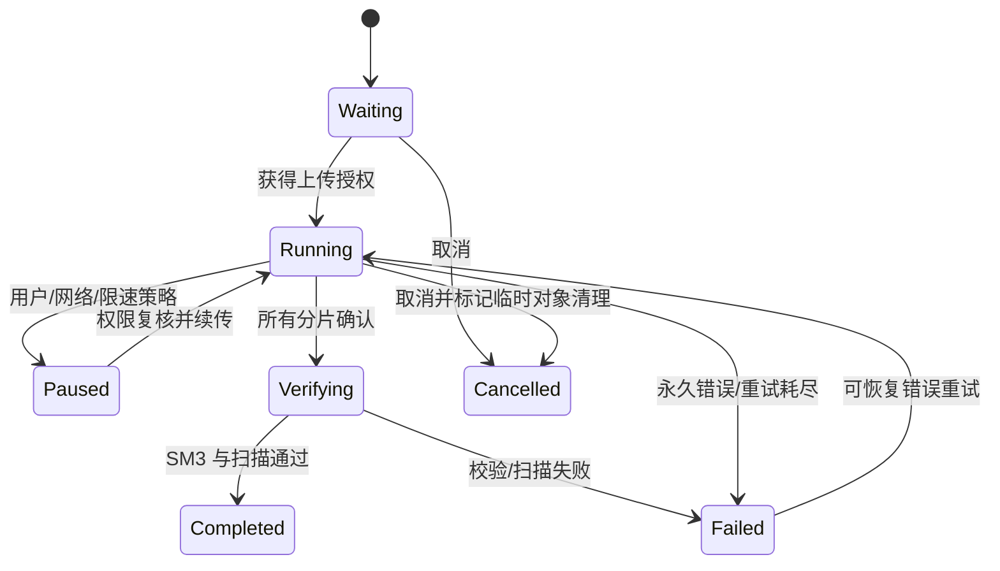

# 文件传输设计

## 选择

MVP 采用服务器中转。混合 P2P 只在中转容量数据证明有必要、同网段探测可靠且安全制度允许时启用；策略中心可全局/部门/密级禁用 P2P。

## 聚合关系

```text
Person → ConversationMember → Conversation → FileTransferTask
                                      └────→ ChatMessage → FileAsset
```

用户从人员资料点击“发送文件”时，Controller 必须先获取/创建唯一单聊，再创建任务。没有有效会话和接收方就没有正式文件任务。

## 状态机



## 分片与续传

- 默认 8 MiB 分片，可在 4～16 MiB 配置；并发 3，最大 8。
- 申请响应返回 task UUID、chunk size、已上传位图和短期授权。
- 分片包含 index、offset、size、SM3；服务端验证边界与摘要后原子确认。
- 客户端只以服务端确认更新 checkpoint；本地崩溃后从 SQLite 恢复。
- 完成时服务端校验分片集合和整文件 SM3，再转正对象并扫描。
- 校验失败重传具体分片；整文件仍失败则终止，禁止静默打开。

## 安全和配额

文件名去除路径、控制字符、尾随点/空格并处理 Windows 保留名；物理 storageKey 由 UUID/分片键生成。服务端限制类型、扩展名、MIME 探测、大小、用户/组织配额、并发和带宽。短期下载票据绑定 person/device/asset/conversation，使用后仍实时验证成员权限。

文件先进入隔离区，恶意扫描通过后可见。扫描引擎不可用时按策略失败关闭或进入人工隔离，不能默认放行。敏感文件可叠加水印/下载次数/过期策略。

## 秒传与去重

客户端上报 size+SM3 只用于候选查询。服务端只有在同一安全域已存在扫描通过的资产且当前用户有合法引用权限时才返回秒传；不能因哈希命中泄露“某文件存在”。对象可物理去重，逻辑 FileAsset 和审计关系仍独立。

## 存储和清理

PostgreSQL 保存资产、任务、分片和下载审计；二进制位于本地受控目录、共享存储或对象存储。删除采用到期标记、宽限、引用检查、物理删除、审计五步。磁盘高水位依次告警、拒绝新大文件、保留消息业务，不能让文件填满系统盘。

## 性能

文件数据面独立于消息 Gateway。读取使用有界缓冲和异步文件 I/O；线程池不超过磁盘/CPU 能力。速度采用指数移动平均，剩余时间在不足 3 个样本时不显示。全局、组织、用户、任务四级令牌桶控制带宽。

## 当前状态

领域对象和 PostgreSQL 表已创建，界面线框与“先会话”Controller 顺序已实现。分片 I/O、SM3、扫描、对象存储、SQLite 恢复、FileTransferModel/View 均尚未实现。

