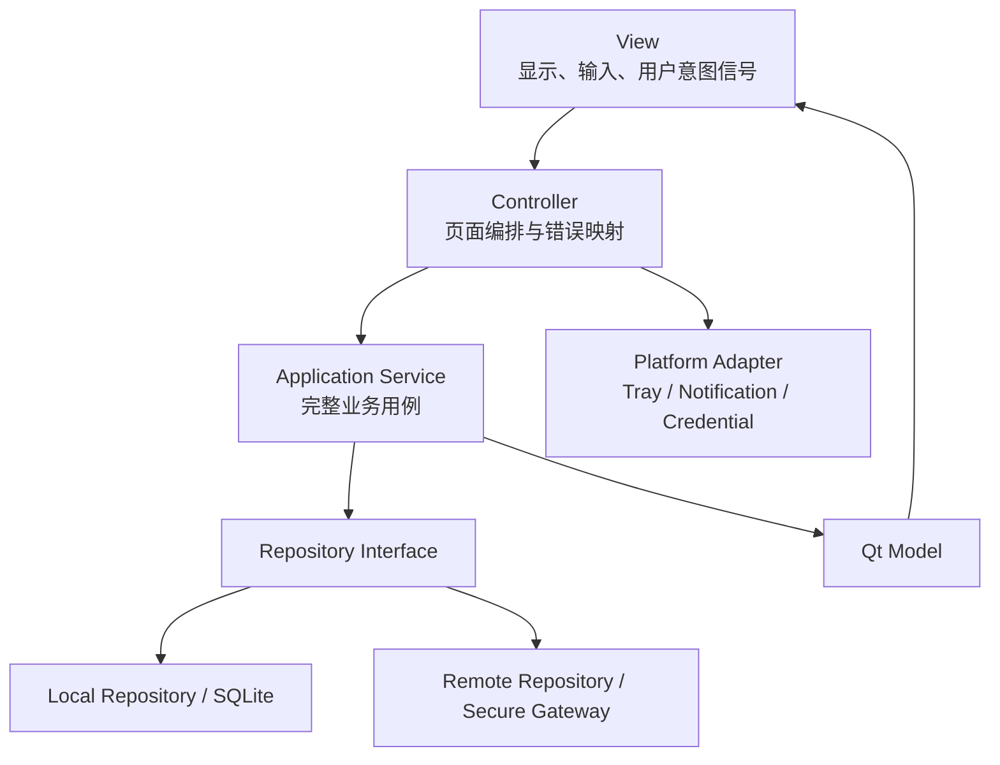
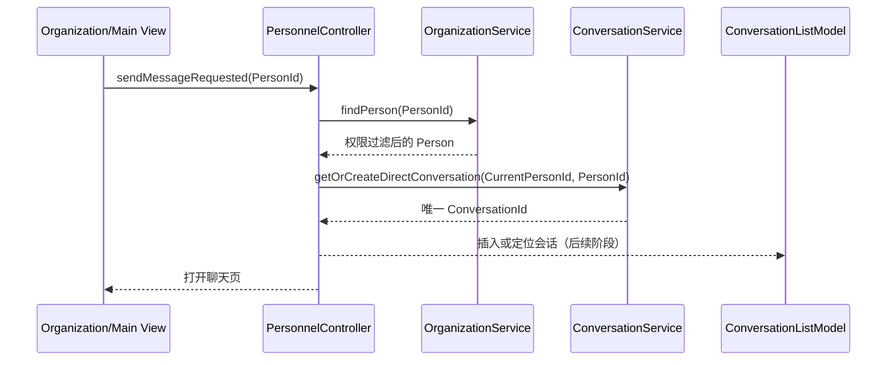
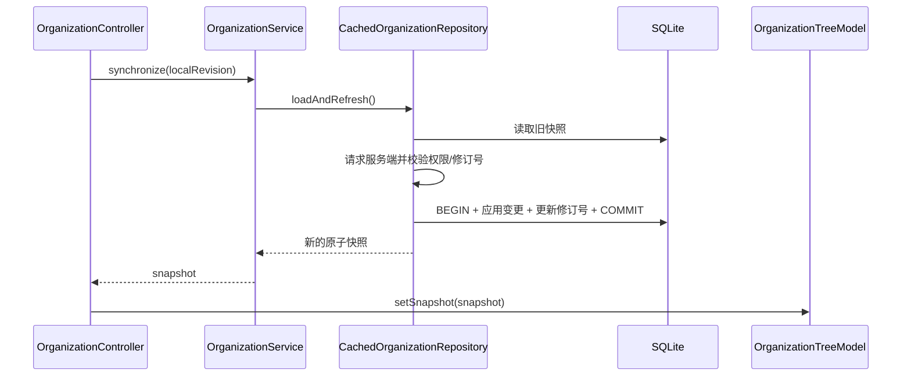

# Qt 客户端 MVC 设计

## 目标与依赖方向

客户端使用 MVC，并用 Application Service、Repository 和平台适配器隔离业务与基础设施。



## 职责

### View

View 创建控件、绑定 Model、收集输入并发出信号。它可以展示 Controller 给出的友好提示，但不得调用网络、数据库、Protobuf 或具体国密 API。`LoginWindow` 和 `MainWindow` 已按此边界实现。

### Model

Model 把领域快照映射为 Qt role/index。`OrganizationTreeModel` 只展示组织和部门，人员单独进入 `DepartmentPersonnelModel`，避免大目录一次创建全部人员树节点。Model 不依赖 QWidget。

### Controller

Controller 接收 View 意图、调用 Service、更新 Model并控制页面/窗口生命周期：

- `AuthenticationController`：验证输入；模拟模式异步成功，生产网关未接入时明确拒绝。
- `OrganizationController`：先取得完整快照，成功后原子更新 Model；失败不破坏旧数据。
- `PersonnelController`：资料查询、唯一单聊、“先会话后文件”的业务顺序。
- `MainWindowController`：将关闭意图交给托盘策略。
- `TrayController`：关闭到托盘、无托盘降级、真正退出意图和未读角标。

### Service

Service 不依赖 QWidget。当前已实现：

- `OrganizationService`：快照、部门递归人员、限量搜索、人员详情。
- `ConversationService`：规范化两名 PersonId 并返回唯一单聊。

后续 `MessageService`、`FileTransferService`、`PresenceService` 等必须沿同一规则实现。

### Repository

`IOrganizationRepository` 是当前仓储端口，`InMemoryOrganizationRepository` 生成 1 个组织、8 个一级部门、20 个二级部门、200 人和 30 个在线状态。生产实现将由本地 SQLite、远程目录和组合缓存仓储承担；同步时顺序为：

```text
读取 SQLite 旧快照 → 请求增量/全量 → 服务端权限校验
→ SQLite 事务写入临时/正式表 → 提交修订号 → queued connection 更新 Model
```

事务失败或进程崩溃不得先更新 `local_organization_revision`。

## 典型流程

### 从人员发起单聊



### 组织同步



## 线程模型

- UI、所有 Qt Model 与大部分 Controller 固定在主线程。
- 网络 I/O 使用独立 `QThread`/Asio 事件线程；每条物理连接只有一个帧解码器。
- 文件哈希、分片读写和恶意文件扫描调度进入有界线程池，线程数默认 `min(4, hardware_concurrency)`，并受磁盘和带宽限流。
- NetworkWorker 不直接触摸 Model；使用 `Qt::QueuedConnection` 或线程安全事件队列回到主线程。
- SQLite 连接不跨线程共享，每个存储工作线程创建自己的连接并通过事务串行写。

## 禁止规则

1. View 不得包含 `QSqlDatabase`、`QTcpSocket`、`QNetworkAccessManager` 或 Protobuf 类型。
2. Model 不得包含或继承 QWidget。
3. Controller 不拼 SQL、不解析协议、不直接调用具体国密库。
4. Domain 不依赖 Qt target。
5. 关闭窗口不得直接终止网络、文件和数据库线程。
6. 信号跨线程时载荷必须可复制、注册元类型且不含悬空引用。
7. 任何敏感字段必须在 Service/服务端权限过滤后才进入 Model。

## 已验证与待补

- 已验证：CMake target 边界、静态令牌检查、纯 C++ Service 可替换仓储、唯一单聊、远程目录、SQLite 事务缓存、Qt 网络线程、消息状态和 Qt offscreen 测试。
- 代码已实现但未做真实桌面托盘交互验证：QtTrayAdapter；关闭/角标策略已用 FakeTrayAdapter 验证。
- 已实现：`ConversationListModel`、本地会话摘要、分会话未读及聚合角标；聊天消息仍由轻量 `QListWidget` 呈现。
- 已实现：`GroupListModel`、`GroupCenterView` 与 `GroupController`，群组页面复用公共 `ApplicationShell` 并通过 `NetworkClient` 访问服务端。
- 已实现：`FileCenterModel`、`FileCenterView` 与 `FileCenterController`，文件中心复用公共 `ApplicationShell`，通过 `NetworkClient` 访问 PostgreSQL 元数据和 MinIO 私有对象。
- 已实现：`CalendarModel`、`CalendarCenterView` 与 `CalendarController`，日程页复用公共 `ApplicationShell`，通过线程安全的 `NetworkClient` 请求周范围、创建、修改与软取消日程；Model 只持有服务端已鉴权的投影和当前筛选状态。
- 已实现：通知与设置模块的独立 Model/View/Controller；尚未实现分页 `MessageListModel` 和自动更新服务。
