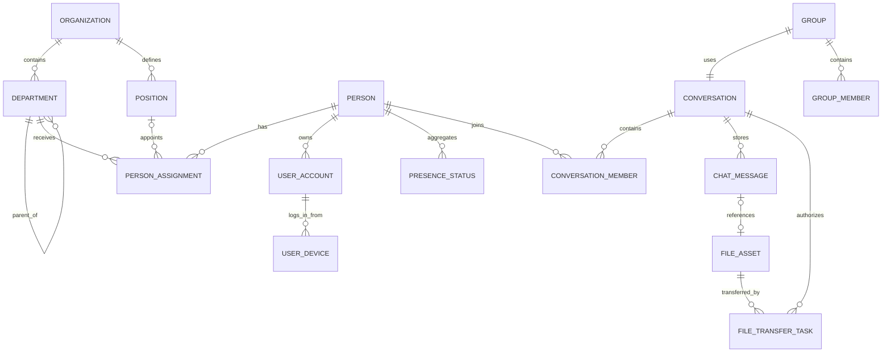
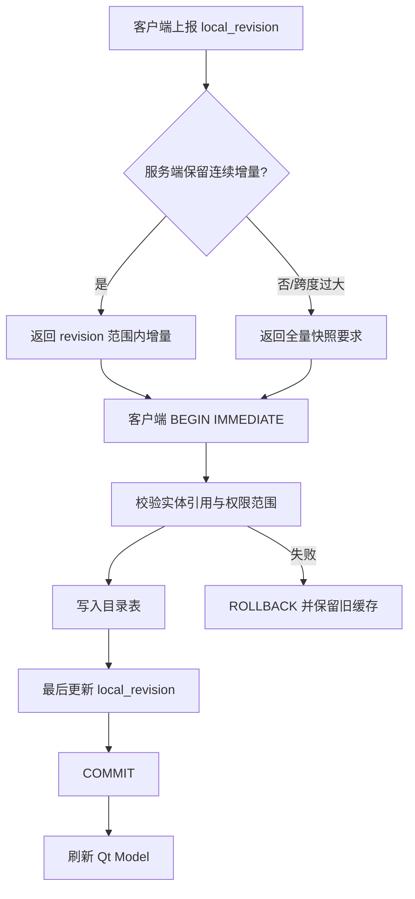

# 组织架构领域模型

## 聚合关系

## 核心概念与不变量

### Organization / Department / Position

- Organization 支持父组织和单调递增目录修订号。
- Department 通过自引用形成任意深度树；移动部门必须检查环路并产生新修订与审计日志。
- Position 是组织内岗位字典，不直接等于部门任职。

### Person / PersonAssignment

- Person 是自然人主体，不能用账号或显示名称替代。
- PersonAssignment 表示多部门、多岗位关系；数据库部分唯一索引保证每人至多一个主任职，应用层保证启用人员至少一个主任职。
- 手机、电话、邮箱、工号按目录可见范围返回；客户端缓存不构成访问授权。

### UserAccount / UserDevice

- 一名人员可以有多个账号；账号生命周期与人员启停关联但不等同。
- 设备由账号拥有，设备 UUID、平台和公钥指纹用于绑定与风险识别。
- 密码只保存带参数的强哈希；设备对象不保存私钥。

### PresenceStatus

设备连接状态和人员汇总状态分离。推荐汇总优先级为：安全强制离线 > 请勿打扰 > 忙碌 > 在线 > 离开 > 离线；隐身对其他用户显示为离线，但审计侧保留真实连接状态。状态必须带过期时间，防止网关故障留下永久在线。

### Conversation / ChatMessage

- 单聊由规范化 `(min(PersonId), max(PersonId))` 唯一确定；应用服务互斥和 PostgreSQL 唯一约束共同防重。
- ConversationMember 保存连续送达/已读序列水位，减少逐消息回执写放大。
- 每个会话序列单调递增；`client_message_id + device_id` 负责发送幂等，`server_message_id` 负责全局追踪。

### Group / GroupMember

GroupType 支持普通、部门、项目、临时和公告群。MVP 完成普通/临时群；部门群成员变更由组织修订驱动。群主必须是有效成员，移交群主和解散必须在事务内完成。

### FileAsset / FileTransferTask

- FileAsset 是完成上传并通过 SM3/扫描后的逻辑资产；物理路径只能由服务端生成的 storageKey 决定。
- FileTransferTask 必须关联有效 Conversation，下载再次验证 ConversationMember 权限。
- 正式文件消息只能在资产校验完成后创建，避免聊天记录引用不完整文件。

## 目录修订与同步

服务端组织写事务同时完成实体变更、`organization_revisions` 加一、`organization_change_logs` 写入和管理员审计。任何直接覆盖而不产生日志的管理接口都应拒绝。

## 可见范围

`DirectoryVisibility` 支持本人、本部门、本部门及下级、指定部门和全组织。判定顺序：账号/人员有效性 → 组织租户边界 → 主体规则 → 字段级脱敏 → 数据返回。客户端隐藏仅优化界面，服务端必须对人员详情、创建会话、建群、文件下载分别重新鉴权。

## 当前实现状态

- 已实现并验证：强类型 ID、200 人 Mock 快照、查询/搜索、唯一单聊、PostgreSQL 001～004、服务端同组织权限边界、全量/增量目录协议和 SQLite 事务缓存。
- 客户端仅在新快照引用闭合且修订不回退时覆盖缓存；Windows 敏感联系方式使用 DPAPI。
- 组织增量按严格连续修订传输，单批最多 500 条；日志断档、跨度过大、未知事件或硬删除会自动回退权限裁剪的全量快照。
- 仅设计：字段级可见范围规则管理。
- 尚未实现：完整事务化组织管理后台、CSV 导入、LDAP/AD 和可配置权限规则执行器。
