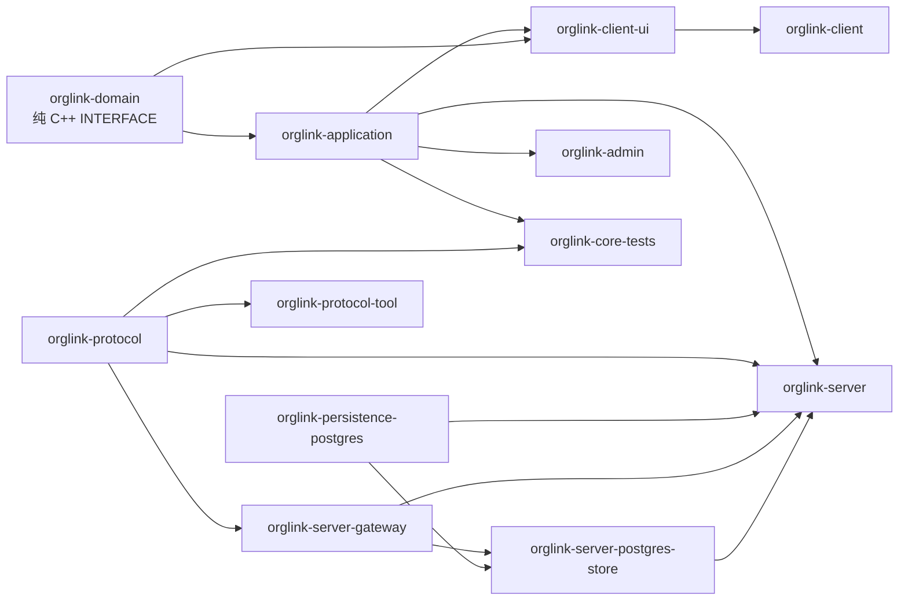

# 工程结构与目标依赖

## 当前目录

```text
OrgLinkSecureIM/
├── apps/
│   ├── client/                 # Qt MVC 客户端与托盘适配
│   ├── server/                 # TLS Gateway、运行时存储与服务端入口
│   ├── admin/                  # 管理工具（当前为只读摘要骨架）
│   └── tools/                  # 事务迁移、协议与负载规划工具
├── libs/
│   ├── domain/                 # 纯 C++ 领域对象和强类型 ID
│   ├── application/            # 组织目录、唯一单聊用例和仓储端口
│   ├── protocol/               # 固定帧、应用消息 wire codec 与流式拆包
│   └── persistence/            # PostgreSQL/libpq 和事务迁移器
├── proto/                      # 版本化 Protobuf 契约，尚未接入生成步骤
├── database/migrations/
│   └── postgresql/             # PostgreSQL 空卷首装与正式迁移源文件
├── deploy/docker/              # Dockerfile、Compose 与一键启动脚本
├── tests/
│   ├── unit/                   # 无第三方框架的核心测试
│   ├── mvc/                    # 目录和依赖静态门禁
│   ├── integration/            # Gateway、PostgreSQL 和外部 TLS 栈测试
│   └── ui/                     # Qt offscreen 冒烟测试
├── docs/                       # 架构、线框、协议、安全与状态报告
├── AGENTS.md
├── CMakeLists.txt
└── CMakePresets.json
```

客户端 `network/`、`storage/`、聊天 Controller/View 和服务端 Gateway/运行时存储已有真实实现；`transfer/`、`security/`、群聊 Model/View 仍待对应功能落地，不放置空目录冒充完成。

## CMake target 关系



- `orglink-domain` 不链接 Qt、PostgreSQL 或网络库。
- `orglink-application` 只依赖领域层，仓储通过接口反转。
- `orglink-client-ui` 在找到 Qt 6 Widgets/Network/Sql 时生成，网络线程不直接触摸 Model。
- `orglink-persistence-postgres` 找到 libpq 时启用真实连接；缺少 libpq 时保留可编译的明确失败实现。
- Docker 构建安装 `libpq-dev` 与 Qt Network，容器服务端包含真实 TLS Gateway 和 PostgreSQL 存储。

## 模块依赖边界

| 发起方 | 可依赖 | 禁止依赖 |
|---|---|---|
| Domain | C++ 标准库 | Qt、libpq、Socket、Protobuf、具体密码库 |
| Application Service | Domain、Repository 接口 | QWidget、SQL、具体网络连接 |
| Qt Model | Domain、Qt Core/Model | QWidget、网络、数据库 |
| View | Qt Widgets、Qt Model | Repository、libpq、Socket、Protobuf |
| Controller | View 接口、Service、Model | SQL、具体国密实现 |
| Persistence | Repository 接口、libpq | QWidget |
| Gateway | Protocol、Application | 客户端 View/Model |

`tests/mvc/CheckMvcBoundaries.cmake` 对最常见越层依赖执行自动检查；语义边界仍需代码评审和依赖 target 共同保证。

## 可选组件

| 组件 | 默认 | 条件 |
|---|---|---|
| Qt 客户端 | 开 | `Qt6::Widgets` 和 `Qt6::Test` 可用 |
| 开发模拟数据 | 关 | `ORGLINK_ENABLE_MOCK_MODE=ON` |
| PostgreSQL libpq | 自动 | 本机或容器找到 PostgreSQL 开发包 |
| 测试 | 开 | `ORGLINK_BUILD_TESTS=ON` |
| Protobuf 生成 | 未接入 | 后续固定 protoc/protobuf 版本后启用 |
| 国密 Provider/HSM | 未接入 | 完成 OpenSSL/Tongsuo/硬件密码设备 POC 后启用 |

## 平台代码边界

- `apps/client/src/tray`：QSystemTrayIcon 与测试适配器。
- 后续 `apps/client/src/platform`：开机启动、原生通知、文件位置、凭据存储。
- 后续 `libs/crypto/providers`：OpenSSL 3、Tongsuo、密码机/密码卡 Provider。
- `deploy/docker` 只面向 Linux 服务端；桌面客户端不在容器中运行。
- ARM64、LoongArch、银河麒麟、UOS、openEuler 尚未实机验证，必须通过独立工具链预设和兼容矩阵进入支持列表。
