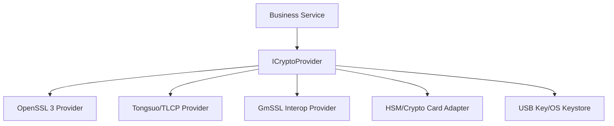

# 国密与安全设计

## 信任边界

客户端、局域网、负载入口、Gateway、业务服务、数据库、对象存储、管理网和密码设备均是独立信任区。所谓“内网”不等于可信：服务端对每次管理、目录详情、会话成员、文件下载和撤回执行鉴权。

## 国密抽象

业务只依赖算法用途：签名/验签、摘要、随机、数据密钥包装、对称 AEAD、证书验证。Provider 返回稳定错误类型和 key handle，私钥可不可导出由实现决定。

## 环境建议

| 环境 | 推荐 | 目的 |
|---|---|---|
| 开发 | OpenSSL 3 软件 Provider，固定测试向量 | 快速构建和单元测试 |
| 集成 | Tongsuo/GmSSL + 内部测试 CA | TLCP/双证书/互操作 |
| 预生产 | 与生产同型号密码机/卡和证书体系 | 性能、HA、运维演练 |
| 生产 | 由合规/测评要求确定的软件或硬件密码模块 | 私钥保护和制度合规 |

这不是认证声明。任何“支持 SM2/3/4”的库都不自动等价于 TLCP 双证书互通或满足特定测评要求。

## 密钥和证书生命周期

1. 密钥在 CSPRNG/HSM 内生成，私钥不可写日志/配置。
2. 证书申请区分签名和加密用途，SAN 使用内部 DNS/VIP。
3. 到期 90/60/30/7 日告警；轮换期新旧证书并行验证。
4. CRL 在局域网可达并定时更新；缓存带 nextUpdate，过期策略按风险等级失败关闭。
5. 吊销后清除会话、路由和客户端信任缓存。
6. 销毁记录进入审计；HSM key handle 不复用。

## 存储加密

- PostgreSQL 敏感列使用信封加密：随机 SM4 数据密钥加密内容，主密钥/HSM 包装数据密钥。
- 文件对象按租户/密级使用独立数据密钥，分片 nonce 唯一，完成后验证整文件 SM3。
- 搜索索引只为可审计级别生成，最小化明文，并与原文权限一致。
- 客户端令牌进入 DPAPI/Secret Service/厂商安全存储；QSettings 不保存密码或私钥。

## 端到端加密分级

| 级别 | 传输 | 服务端内容 | 搜索/审计 | 用途 |
|---|---|---|---|---|
| 普通办公 | TLS/TLCP | 受控可解密/加密存储 | 完整 | 默认 |
| 敏感 | TLS/TLCP | 受策略服务临时解密 | 受限且全审计 | 指定部门/会话 |
| 特殊密级 | TLS/TLCP + E2EE | 不可解密 | 无正文搜索/审计 | 制度批准后启用 |

E2EE 的密钥恢复、多设备、成员移除后的未来保密和备份恢复必须单独设计；不允许用“更安全”一句话覆盖治理损失。

## 威胁控制摘要

- 暴力破解：账号/IP/设备多维限流、渐进延迟、锁定和告警。
- 重放：时间窗、nonce、请求幂等键、TLS 会话绑定。
- MITM：受控根、完整链和主机名验证、证书吊销；不提供“忽略证书错误”。
- 协议伪造/篡改：固定魔数/版本/上限、TLS/TLCP、AEAD/签名。
- 路径穿越：服务端生成 storageKey，规范化文件名只作展示。
- 恶意文件：类型/大小、隔离区、扫描接口、完成前不可下载。
- 越权：从连接认证上下文推导主体，不信任 header user_id；资源级实时鉴权。
- SQL 注入：PQexecParams/预编译参数，不拼用户输入。
- 日志泄露：字段 allowlist、正文/令牌/口令禁止、导出再次脱敏。
- 数据库：orglink_app 只获 DML/序列权限；owner 仅迁移使用。
- 管理操作：mTLS/MFA、独立网段、双人复核高风险操作、不可抵赖审计。

## 安全测试

算法 KAT、证书链/吊销/过期、协议 fuzz、认证绕过、会话固定、重放、越权、SQL 注入、路径穿越、压缩炸弹、超大帧、恶意文件、日志敏感信息、依赖 SCA/SBOM、镜像扫描和最小权限容器。严重/高危漏洞为零才可验收。

## 当前状态

已实现并验证：严格 TLS（不调用 `ignoreSslErrors`）、开发 CA、bcrypt 与锁定、参数化 SQL、最小权限数据库角色、消息 AES-256 静态加密过渡、Windows DPAPI 本地缓存，以及只读非 root 容器。尚未实现/验证：SM2/SM3/SM4、TLCP、双向认证、正式 CA/吊销、HSM/密码机/USB Key、完整渗透与算法 KAT。
