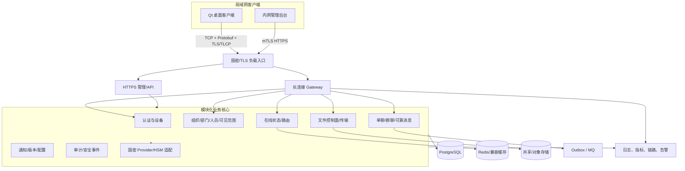
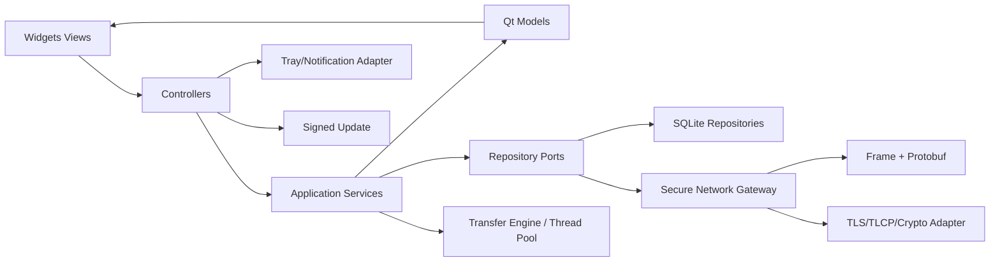
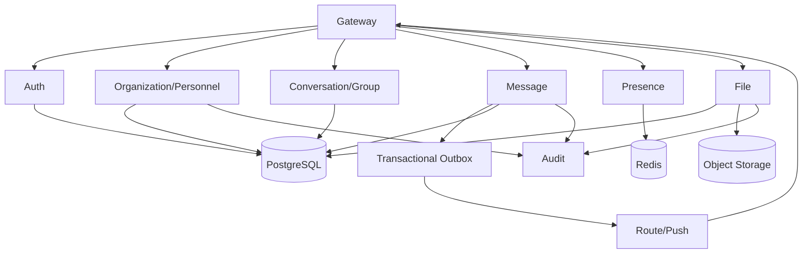
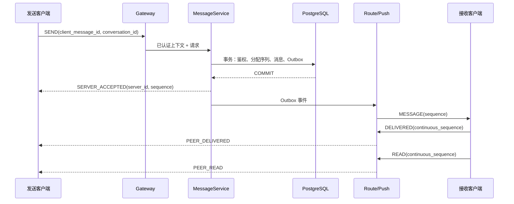
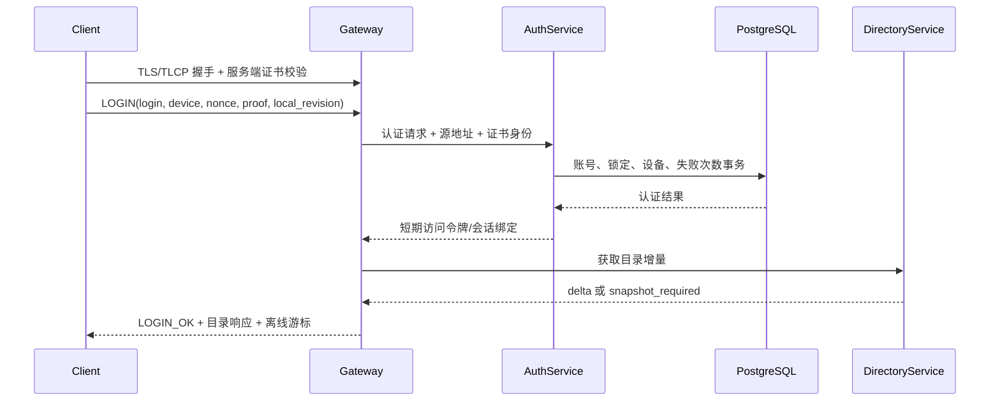
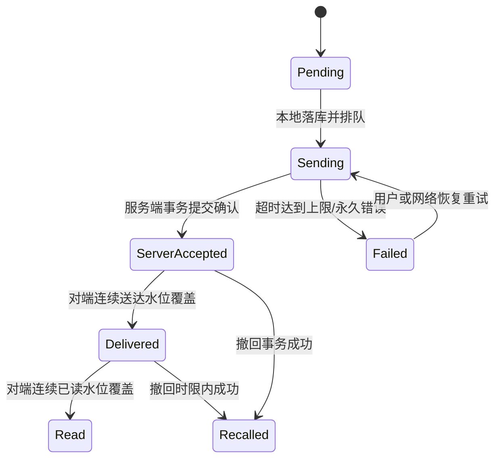
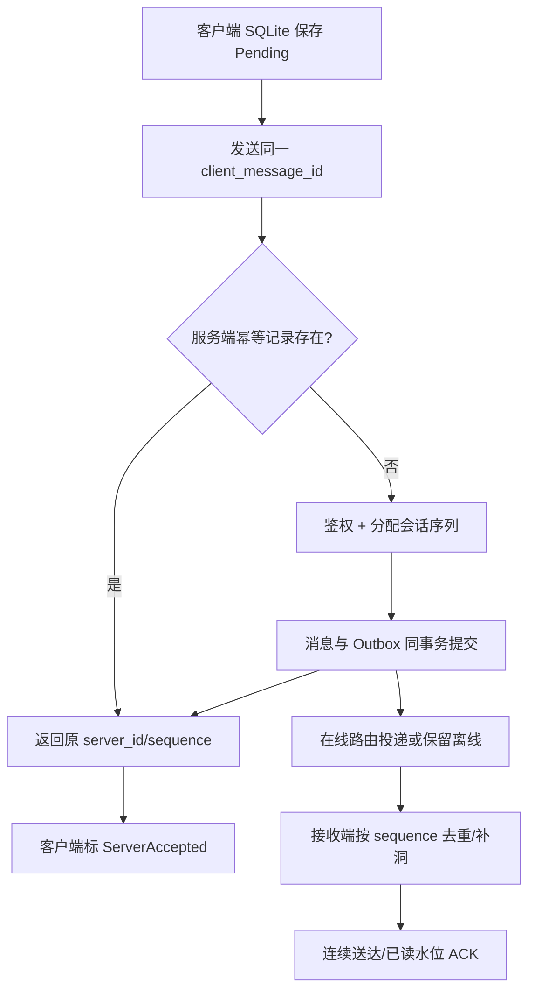
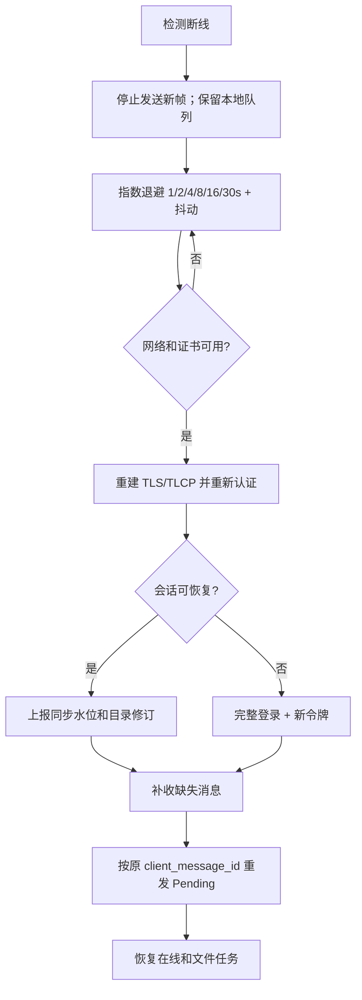
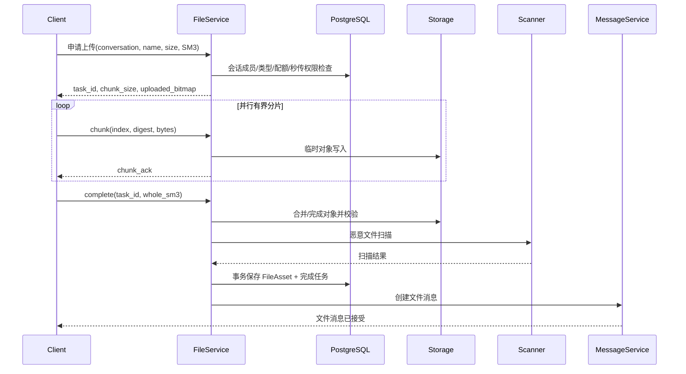
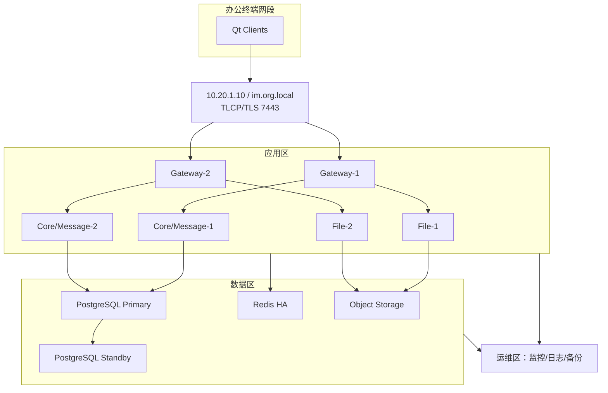

# OrgLink Secure IM 完整技术方案

> 文档状态：架构基线 v0.1。本文同时描述目标架构和当前仓库实现；“目标”不代表已经开发或通过信创/国密认证。实际验证状态以 [test-report.md](test-report.md) 为准。

## 1. 项目理解与建设目标

安域通是只依赖内部局域网的政企即时通信平台，以组织、部门、岗位和人员目录为业务基座，再建立账号、设备、在线状态、单聊、群聊、文件与审计。系统需要在 100～50000 用户范围内按部署等级扩展，支持 Windows 与国产 Linux 客户端、PostgreSQL 服务端基线、国密通信能力和离线升级。

建设目标按优先级为：

1. 身份和目录正确：人员不等于账号；可见范围由服务端最终校验。
2. 消息不丢不重：端到端业务确认、幂等、排序、离线补偿和恢复可证明。
3. 文件受控：会话授权、分片续传、SM3 完整性、扫描和审计闭环。
4. 安全可运营：国密传输、密钥/证书生命周期、最小权限、审计和告警。
5. 信创可验证：源码构建、依赖清单、多架构包和实机 POC，不虚构认证。
6. 可渐进部署：小型模块化单体，中大型按连接、消息、文件等热点独立扩容。

## 2. 需求边界与假设

- 只运行于受控局域网，不依赖公网推送、云对象存储或第三方 SaaS。
- 客户端统一采用 Qt 6/C++20 + Qt Quick/QML，覆盖 Windows 桌面、Android 平板/手机和 iPhone/iPad；各平台的签名、商店发布和实机兼容结论必须由对应 SDK 与设备 POC 给出。
- 服务端固定 PostgreSQL；国产数据库切换作为后续兼容适配，不在当前基线替换主库。
- 管理后台推荐内网 Web，而不是复用桌面客户端：集中升级、表单/报表效率和最小部署成本更优；必须双因素/证书认证与独立管理网段。
- 小文件和默认文件经服务器中转；大文件 P2P 只作为可关闭的受控优化，不绕开策略、审计和最终权限检查。
- 默认不启用不可审计的端到端内容加密；对特殊密级会话按策略启用并接受搜索/审计能力下降。
- 精确性能、国产 CPU/OS、TLCP、密码设备和国产数据库结论必须由目标硬件 POC 给出。

## 3. 技术选型与理由

### 3.1 Qt Quick/QML 与 C++ 边界

| 维度 | Qt Widgets | QML/Qt Quick |
|---|---|---|
| 政企桌面控件、树表、快捷键 | 成熟直接 | 需额外封装 |
| 低端/国产 GPU 风险 | 较低 | 场景图依赖更强 |
| 动画和触摸 | 一般 | 优秀 |
| C++ MVC 与审查 | 直观 | C++/JS/QML 三层边界更复杂 |
| 推荐 | 仅保留迁移回归夹具 | 全部生产界面与音视频预览 |

最终选择 Qt Quick/QML。QML 只承担自适应布局、属性绑定、触控/键盘意图和轻量显示格式；认证、网络协议、实时消息合并、权限相关状态、文件原子落盘、安全打开、设置修订和持久化全部在 C++ Controller/Service/Repository。生产库不链接 QWidget；旧 Widgets 源码隔离在桌面迁移回归库中。桌面采用三栏或四栏，平板折叠次要详情栏，手机使用抽屉导航与单栏详情切换，交互目标最小 44 逻辑像素。

### 3.2 网络框架和协议

- 客户端：Qt Network 与独立网络线程，便于 Qt 事件循环、代理与证书集成。若 TLCP Provider 与 QSslSocket 兼容性不足，SecureConnection 封装切换到 standalone Asio + Tongsuo。
- 服务端：当前 POC 使用 Qt Network `QSslServer` 实现事件驱动长连接，与客户端共享 TLS/事件模型；连接规模与性能证据超过单节点边界时，再评估 standalone Asio/Boost.Asio。HTTP 管理与文件控制面可用 Drogon。
- 长连接：自定义二进制 TCP 协议 + Protobuf；服务器管理/健康/版本接口使用 HTTPS；内部同步调用优先 gRPC/HTTP2，异步领域事件经可靠消息总线。
- WebSocket 只为未来 Web 管理或受限浏览器通信保留，不作为桌面主链路，减少额外帧开销。

### 3.3 序列化

| 方案 | 优点 | 局限 | 结论 |
|---|---|---|---|
| JSON | 可读、调试方便 | 体积、类型和兼容约束弱 | 管理接口/诊断 |
| Protocol Buffers | 强类型、体积小、跨语言、字段演进成熟 | 需固定 protoc 工具链 | 主协议推荐 |
| MessagePack | 紧凑、动态 | 契约治理弱于 Protobuf | 不选主协议 |
| FlatBuffers | 零拷贝读取 | 模式和更新复杂，消息体通常不够大 | 性能证据出现后再评估 |

### 3.4 数据与中间件

- PostgreSQL 16 主数据库：事务、约束、JSONB、部分索引、丰富运维工具；服务端通过 libpq/PQconnectdbParams，业务 SQL 必须参数化。
- 客户端 SQLite：WAL、本地消息/目录缓存和事务化修订更新；每线程连接，不共享 QSqlDatabase 句柄。
- Redis：仅用于连接路由、短期 Presence、限流和热点缓存；故障时回退数据库/本节点状态，不作为消息最终事实源。
- 消息队列：小中型先用 PostgreSQL Outbox + 内部异步总线；超过 5000 用户或跨节点事件明显时引入 RocketMQ/Kafka。RabbitMQ适合任务/路由，Kafka适合高吞吐事件保留；不可在无容量证据时同时引入多个 MQ。
- 文件：小型本地受控目录，中型共享 POSIX/NAS，大型 S3 兼容对象存储（MinIO 或国产产品 POC）。元数据始终在 PostgreSQL。

## 4. 推荐最终技术栈

| 层 | 推荐 |
|---|---|
| 语言 | C++20，避免非必要 C++23 特性以兼容信创工具链 |
| 桌面 UI | Qt 6 Widgets，Qt Model/View，必要时 Qt 5.15 LTS 兼容分支 |
| 构建 | CMake 3.24+、Ninja/MSVC，多架构 Preset |
| 主协议 | TCP + 68 字节网络序帧头 + Protobuf v3 |
| 服务网关 | Asio，多 reactor/单连接单线程归属 |
| 主数据库 | PostgreSQL 16，libpq，SQL 迁移 |
| 客户端缓存 | SQLite 3（WAL、事务、FTS 按权限启用） |
| 缓存 | Redis 7 兼容接口，可替换国产兼容产品 |
| 文件 | 服务端中转为默认；共享/对象存储后端抽象 |
| 密码 | OpenSSL 3 Provider 抽象；TLCP 用 Tongsuo/合规设备 POC |
| 日志/观测 | spdlog + OpenTelemetry + Prometheus/Grafana，可输出国产平台格式 |
| 测试 | CTest、Qt Test、协议 fuzz、网络故障注入、容器集成测试 |
| 部署 | Docker Compose 单机基线；HA 可用物理/虚机或 Kubernetes |

## 5. 系统总体架构

### 5.1 总体图



### 5.2 客户端模块



### 5.3 服务端模块关系



## 6. 客户端详细设计

登录成功默认进入“组织”，导航顺序为组织、消息、群组、文件、通知、设置。UI 主线程只做轻量 Model 更新；网络帧解析在独立线程，文件 I/O/SM3 在有界线程池，SQLite 写入在存储线程事务中完成。

会话列表仅保留摘要和分页游标；MessageListModel 首屏 50 条、向上滚动按序列分页，缓存最近 200～500 条，图片缩略图和文件元数据按需加载。每个会话草稿独立持久化。退出流程见 [tray-design.md](tray-design.md)。

本地缓存必须包含 organizations、departments、positions、persons、person_assignments、organization_sync_state、conversations、messages、transfer_tasks、window_state 和偏好；登出或可见范围缩小时事务删除越权敏感缓存。

## 7. 服务端详细设计

### 7.1 模块化单体与微服务边界

- 100～500：一个模块化单体进程 + PostgreSQL + 本地/共享文件，Redis 可选。最低运维成本。
- 500～5000：Gateway 至少两节点，业务核心可仍为单体，Redis HA、PostgreSQL 主备、共享文件，Outbox 消费者独立。
- 5000～50000：按 Gateway、Message、File、Directory/Admin、Audit 拆分；只有明确独立扩容或故障隔离收益的模块成为服务。

认证、目录、会话创建等强一致命令使用同步调用；消息投递、通知、审计、文件扫描使用异步事件。每个业务写事务同时写 Outbox，消费者以 event_id 幂等，避免数据库成功而 MQ 发送失败。

用户到 Gateway 映射放 Redis：`route:{person}:{device} -> gateway_node + connection_id + expiry`，网关心跳续租；消息服务查路由后向节点发布内部投递事件。Redis 故障时保留本节点在线连接并降级为离线写入，不虚报其他节点在线。

文件数据面不经过消息 Gateway，以独立限流端口/HTTP 分片服务传输；Gateway 只承载申请、授权、进度和完成事件，避免大文件阻塞聊天心跳。

### 7.2 消息发送时序



### 7.3 登录认证时序



## 8. 即时通信协议

TCP 帧采用网络字节序固定 68 字节头：magic、version、header_size、message_type、flags、request_id、session_id、user_id、device_id、timestamp_utc_ms、sequence、body_length、checksum。错误码、安全扩展、conversation/person 和幂等键位于 Protobuf Envelope/具体消息中；header_size 预留 TLV 扩展，但当前解码器拒绝未知扩展长度以“安全失败”。

编码顺序：Protobuf → 可选压缩（建议 >1 KiB 且压缩收益阈值达标）→ 内容加密/AEAD → CRC 传输校验 → 帧头。接收顺序相反，并先检查 magic/version/header/body 上限再分配内存。CRC32 不是安全完整性机制，安全性由 TLS/TLCP 和 AEAD/签名提供。

粘包/半包：每连接一个 FrameDecoder，追加读缓冲；少于 68 字节等待；头完整后校验最大 16 MiB；体不完整等待；CRC 失败清空连接缓存并断开。禁止无限增长缓冲。

心跳建议空闲 15 秒发送 PING，5 秒未收到 PONG 标记可疑，连续 3 次失败断开。移动/弱网可由服务端协商 15～60 秒，加入 ±10% 抖动避免惊群。

超时重试：登录/目录/普通请求 5～10 秒指数退避；消息使用同一 client_message_id 重发；非幂等管理命令必须提供 idempotency_key。协议升级只新增字段/枚举，废弃字段保留编号，服务端维护最低/最高版本窗口。

限流：每连接令牌桶、每账号/设备配额、每 IP 登录漏桶、每会话消息峰值和全局背压；文件独立带宽桶。超限返回稳定错误码和 retry_after，不直接无限排队。

详见 [protocol-design.md](protocol-design.md) 和 `libs/protocol`。

## 9. 消息可靠性

### 9.1 状态机



可靠投递流程：



去重键为 `(sender_device_id, client_message_id)`；排序键为 `(conversation_id, sequence)`。接收端若出现序列洞，暂存有限窗口并请求缺失区间；超窗时启动游标同步，不无限等待。多端同步以每设备 `last_synced_sequence` 和人员连续已读水位合并。

数据库写失败不向客户端确认；Outbox 派发失败由后台重试；服务重启扫描未发布 Outbox。客户端断线后上报各会话水位，服务端分页补偿。状态只允许单调前进，撤回是独立终态。

### 9.2 断线重连



## 10. 文件传输

### 10.1 方案比较

| 维度 | 全部中转 | 全部 P2P | 混合方案 |
|---|---|---|---|
| 安全/权限 | 最强、集中控制 | 客户端暴露面大 | 控制面强，P2P 需额外授权 |
| 稳定性 | 服务器可恢复 | 依赖双方同时在线 | 中转回退 |
| 服务器带宽 | 高 | 低 | 可控 |
| 多网段/防火墙 | 简单 | 复杂 | 需探测与回退 |
| 审计/扫描 | 完整 | 难保证内容检查 | 元数据完整，直传扫描受限 |
| 实施复杂度 | 低 | 高 | 最高 |

推荐分阶段：首期全部服务器中转，确保安全、审计和可用；容量数据证明大文件成为瓶颈后，再启用“默认中转 + 同网段大文件受控 P2P + 自动回退”。政企策略可强制禁用 P2P。

### 10.2 上传下载时序



分片建议 4～16 MiB，默认并行 3～4，按磁盘/网络动态调节。每片和整文件 SM3，临时路径由 task UUID 生成；原文件名仅作为元数据，规范化并拒绝控制字符、保留名和路径分隔。断点记录已确认位图/连续水位；校验失败最多自动重传可疑分片一次，再明确失败。

下载每次签发短期、单资产、单人员/设备授权；不信任 storageKey 参数。文件过期采用标记删除 → 宽限 → 物理清理，审计记录独立保留。

## 11. PostgreSQL 数据库设计

当前迁移 `001`～`010` 已定义组织、部门、岗位、人员、任职、账号、设备、登录、可见范围、会话、唯一单聊、群组、成员、稳定群号、群标签、消息、多接收人 Outbox、回执、文件、分片、下载审计、Presence 历史、会议、配置、审计、安全事件、客户端版本、导入任务、通知中心、带修订号的人员设置快照，以及通讯录个人档案、最近联系和偏好变更审计。

关键约束：

- `(organization_id, employee_number)`、登录名、设备 UUID 唯一。
- 每人主任职用部分唯一索引；单聊按排序后的两人唯一。
- 消息按会话序列唯一，发送设备 + 客户端消息 UUID 唯一。
- 群号唯一；群消息 Outbox 按 `(message_id, recipient_person_id)` 唯一，允许一条消息为多个有效成员独立维护投递状态。
- 查询索引以 `(conversation_id, sequence DESC)` 分页，禁止 OFFSET 扫描深历史。
- 文件 storage_key 唯一且服务端生成；物理文件不存数据库大字段。
- 通讯录档案以 `(owner_person_id, contact_person_id)` 唯一并禁止自关联；收藏、标签和备注只对 owner 可见，revision 冲突不覆盖并发修改，前后快照审计不写入电话或邮箱。
- 最近联系次数和时间只在唯一单聊成功建立的服务端事务中更新，客户端不能直接伪造；联系人详情按认证人员所在组织裁剪，共同群组还要求双方均为有效成员。

分区：MVP 先用单表；当 messages 达 1～3 亿行或维护窗口受影响时按月/季度 RANGE 分区，迁移前压测查询计划、唯一约束与归档工具。归档先导出校验、只读验证，再删除热表分区。

容量公式：`日消息数 × 平均行+索引字节 × 保留天数 × 副本/膨胀系数`。以 5000 用户、70% 在线、每在线用户 200 条/日、平均数据库占用 1.2 KiB、保留 365 日估算约 300 GiB（含索引、30% 余量）；必须用真实消息体与索引采样修正。文件容量单独按用户/日上传量和保留期计算。

备份：每日全量/每周基线 + WAL 连续归档，季度恢复演练；RPO 中型 ≤15 分钟、大型 ≤5 分钟，RTO 分别 ≤2 小时/≤30 分钟。备份加密、异机保存、恢复后做行数/SM3/权限验证。

## 12. 国密与安全

### 12.1 密码体系

- SM2：服务/客户端证书、签名、密钥封装；私钥优先在密码机/密码卡/USB Key 中不可导出。
- SM3：文件和升级包完整性、审计链摘要；口令哈希不能直接用单次 SM3，应使用合规口令派生策略并经安全评审。
- SM4：内容/文件存储加密，推荐 GCM/带认证模式；若设备只支持 CBC，必须 Encrypt-then-MAC 且 IV 随机唯一。
- 随机数：系统 CSPRNG 或合规设备，禁止 `std::rand`、时间戳和 UUID v4 实现假定为密钥随机源。

开发环境可用 OpenSSL 3 Provider 抽象完成 SM2/3/4 单测；互通测试用 Tongsuo/GmSSL 与目标 CA；生产根据测评要求接入合规密码机/卡。具体库、算法标识、双证书和 TLCP 版本必须以采购设备与测评口径 POC，不能仅凭“支持 SM 算法”推断 TLCP 合规。

双证书体系区分签名证书与加密证书。服务端默认双向认证可按终端管理成熟度分级：受管政务终端使用 mTLS/TLCP 客户证书，普通企业内网可服务端认证 + 账号/设备绑定。CRL 必须局域网可达并缓存，离线期间采用严格过期与告警策略；OCSP 如依赖公网则不可作为唯一吊销手段。

### 12.2 端到端加密决策

默认使用传输加密 + 服务端存储加密，因为政企通常需要搜索、敏感词、备份、审计和数据治理。分级策略：普通办公可审计；敏感会话内容级 SM4 且服务端受控解密；特殊密级可选 E2EE，明确禁用服务端全文搜索/内容审计并采用客户端密钥恢复策略。启用 E2EE 必须经过制度批准，不由用户任意绕过审计。

### 12.3 安全控制

认证失败计数、渐进延迟、账号/IP/设备多维限流；短期访问令牌绑定设备和 TLS 会话；nonce+时间窗口+幂等键防重放；服务端证书固定信任域/链验证防 MITM；帧长和递归深度上限防内存攻击；所有 SQL 参数化；文件名不参与物理路径；下载按会话成员实时鉴权；日志默认脱敏；数据库应用角色无 DDL；管理操作和安全事件不可抵赖审计。

详见 [security-design.md](security-design.md)。

## 13. 信创适配

### 13.1 CPU 与工具链

| 架构 | 建议工具链 | 风险/状态 |
|---|---|---|
| 鲲鹏/飞腾 ARM64 | GCC/Clang aarch64，目标 OS 原生构建 | 依赖普遍较好，未实测 |
| 龙芯 LoongArch64 | LoongArch GCC，原生/厂商 SDK | Qt/Protobuf/密码库需源码 POC |
| 兆芯/海光 x86_64 | GCC/Clang | 接近 x86_64，仍需指令集基线测试 |
| 申威 | 厂商工具链 | 第三方依赖和字节序/ABI 高风险，单独 POC |

协议显式网络字节序，不序列化 C++ struct 内存布局。SIMD 优化必须有标量回退并运行 KAT；编译包不得默认启用构建机 `-march=native`。每架构在目标 OS 源码构建、运行单元/协议/72 小时稳定性和国密性能测试。

### 13.2 国产桌面系统

麒麟、UOS、中科方德、openEuler 逐版本建立 Wayland/X11 × DPI × 输入法 × 桌面环境矩阵。验证字体、fcitx/ibus、托盘、原生文件选择器、剪贴板、高 DPI、多屏、打印、开机启动和 deb/rpm 升级回滚。Qt 插件随包部署但遵守许可证和系统 ABI，不能复制目标系统不允许再分发的插件。

### 13.3 数据库与中间件抽象

虽然当前固定 PostgreSQL，Repository/SQL dialect 层仍隔离分页、序列/identity、时间、JSON、大字段和 upsert。达梦、人大金仓、GaussDB、OceanBase、TiDB 不能只因“兼容 PostgreSQL/MySQL”就宣称兼容；必须用迁移、事务隔离、索引、参数类型、故障切换和性能用例 POC。ODBC 用于兼容基线，性能热点可用原生驱动；避免业务层依赖厂商 ORM 特性。

### 13.4 依赖与许可证

| 依赖 | 用途 | 常见许可证 | ARM64 | LoongArch | 策略 |
|---|---|---|---|---|---|
| Qt 6 | 客户端 | LGPLv3/GPL/商业（按组件核实） | 是 | 需 POC | 动态链接/商业评审 |
| Protobuf | 协议 | BSD-3-Clause | 是 | 源码 POC | 固定 protoc/runtime 同版本 |
| Asio/Boost | 网络 | BSL-1.0 | 是 | 源码 POC | 禁用不必要模块 |
| PostgreSQL/libpq | 数据库 | PostgreSQL License | 是 | 目标发行版 POC | 容器/系统包 |
| SQLite | 本地缓存 | Public Domain | 是 | 是/POC | 启用必要编译选项 |
| spdlog/fmt | 日志/格式 | MIT | 是 | 源码 POC | 日志脱敏封装 |
| OpenSSL | TLS/国密基础 | Apache-2.0 | 是 | 源码 POC | Provider 封装 |
| Tongsuo/GmSSL | TLCP/国密互通 | 逐版本核实 | 是 | POC | 不直接泄漏到业务层 |

使用 lockfile/版本清单、SBOM、许可证扫描、OSV/NVD/厂商公告和季度升级窗口；紧急高危漏洞走 24～72 小时评估。许可证结论必须由法务按实际版本和链接方式确认。

## 14. 部署与高可用

当前 Docker Compose 基线使用 PostgreSQL、私有 MinIO、LiveKit、会议 Web 插件、独立 owner/app 角色、健康检查、内部网络、只读服务端容器、去能力和 no-new-privileges。启动：

```powershell
Copy-Item deploy/docker/.env.example deploy/docker/.env
# 在 .env 填写数据库、消息存储、MinIO、LiveKit 与管理员的独立高强度秘密
.\deploy\docker\up.ps1
```

初始化目录只在空数据卷执行；已有数据卷升级必须使用 `orglink-migrator` 的未来事务执行能力，不能依赖重新挂载 init 脚本。该约束与 PostgreSQL 官方镜像行为一致。

部署拓扑：



IP 只写配置，不编入程序；内部 DNS 使用 `im.org.local`、`admin.org.local`、`db.org.local`。证书 SAN 包含正式 DNS 和必要 VIP，不依赖 IP 证书。端口建议 7443 长连接、8443 管理 HTTPS、9443 文件数据面、5432 数据区仅应用网段可达、9090 指标仅运维网可达。

单机 100～500：应用/PG/文件分卷，外置备份。HA 500～5000：2 Gateway、2 Core、PG 主备、Redis HA、共享存储、负载均衡。集群 5000+：消息/文件独立扩容、PG HA/分区、缓存/MQ/对象存储集群和集中观测。

## 15. 性能与容量

下表是压测起点，不是已验证能力：

| 指标 | 小型 100～500 | 中型 500～5000 | 大型 5000～50000 |
|---|---:|---:|---:|
| 假设在线率 | 60% | 70% | 75% |
| 长连接 | 60～300 | 350～3500 | 3750～37500 |
| 平均消息/s | 5～30 | 30～300 | 300～3000 |
| 峰值消息/s | 100 | 1000 | 10000 |
| 同时文件任务 | 10～30 | 50～300 | 300～2000 |
| 接入节点 | 1 | 2～4 | 4～12 |
| 应用资源起点 | 4C/8G | 2×8C/16G | 按服务 8～16C/16～32G |
| PG 资源起点 | 4C/16G | 8～16C/32～64G | 16～32C/64～128G + HA |

带宽按 `消息峰值×平均帧 + 文件并发×限速 + 30%余量`。例如 100 个文件任务各 10 MiB/s 已接近 8 Gbit/s，必须限制并发/单任务速率并将文件数据面与消息网关隔离。

测试包括阶梯登录、10k/50k 长连接心跳、消息吞吐/p50/p95/p99、1 KiB～16 MiB 帧、文件 1 MiB～100 GiB、丢包/延迟/乱序/断网、节点 kill、PG failover、国密握手/SM4/SM3、国产 CPU/数据库对照和至少 72 小时稳定性。禁止只看平均值。

## 16. 运维、监控与审计

核心 SLI：连接数、登录成功率、认证失败/锁定、消息接受 p95/p99、Outbox 积压、投递延迟、序列缺口、PG 连接池/锁/复制延迟、文件吞吐/校验失败、证书剩余天数、磁盘水位和崩溃率。

日志使用 trace_id/request_id/server_message_id，不记录令牌、密码、私钥、完整正文和真实物理路径。审计日志包含主体、动作、目标、结果、来源和关联 ID；写入失败时高风险管理命令应失败关闭。告警分级并提供操作手册，证书在 90/60/30/7 日预警。

滚动升级先兼容数据库/协议，再灰度 Gateway，观察 SLI，最后业务节点；数据库采用 expand → migrate → contract，禁止同一版本同时做破坏性 schema 与代码切换。客户端更新包必须 SM2 签名/SM3 校验，保留上一版本完整包和数据迁移回滚路径。

## 17. 工程目录

当前目录、目标关系和可选组件见 [project-structure.md](project-structure.md)。客户端 MVC 见 [mvc-design.md](mvc-design.md)，领域见 [organization-domain.md](organization-domain.md)。空模块不会为了目录“齐全”提前创建。

## 18. 关键代码起点

- `libs/domain/.../DomainTypes.h`：强类型 ID 和完整领域对象。
- `libs/application`：目录服务、快照校验仓储、Mock 仓储和唯一单聊。
- `libs/protocol`：68 字节帧头、网络序、CRC、流式拆包和应用消息 codec。
- `libs/persistence`：UTF-8 libpq 连接与带锁/校验和的事务迁移器。
- `apps/server`：TLS Gateway、PostgreSQL 认证/目录/单聊/群组/可靠消息运行时存储、MinIO SigV4 对象插件和 LiveKit 短期会议令牌 Provider。
- `apps/client`：Qt MVC、公共 `ApplicationShell`、网络线程、SQLite/DPAPI、消息中心、群组中心、通知中心、设置中心和托盘适配器。
- `deploy/conference-web`：固定 LiveKit JS 依赖并由 Nginx 提供的浏览器会议端。
- `proto`：目录、消息、RequestContext 与稳定错误结构。
- `database/migrations/postgresql`：可执行 PostgreSQL 模式。

已实现心跳、登录离线补偿、SQLite/DPAPI、TLS Gateway、目录全量/连续增量、服务端会话列表/历史、群组列表/详情/创建/加入/成员管理、群消息实时与离线扇出、分会话未读、送达/已读回执、8 MiB 内 MinIO 文件和 LiveKit 会议入口；客户端自动重连/超时重发、多设备已读合并、SM2/SM3/SM4、TLCP、群审批/解散及大文件分片续传尚未实现，不能把设计文本当作代码完成。

## 19. 测试与验收

层次：Domain/Service 单元测试 → 协议字节与 fuzz → Repository/PG 容器集成 → Gateway 客户端集成 → Qt offscreen UI → 网络故障/安全 → 性能/稳定性 → 信创矩阵 → 升级/恢复演练。

建议验收门槛（在约定负载和网络条件下）：登录成功率 ≥99.95%；已接受消息最终投递/离线可取回率 100%；消息丢失率 0；在线消息 p95 ≤200 ms、p99 ≤500 ms；文件成功率 ≥99.9%、完整性 100%；重连 60 秒内成功率 ≥99.9%；72 小时无不可恢复崩溃/泄漏；服务可用性按部署等级 99.9%/99.95%；高危/严重漏洞 0。

国密“合规”必须提供算法 KAT、互操作、证书/设备报告和测评结论；信创“兼容”必须提供目标 OS/CPU/数据库实测记录。

## 20. 分阶段实施计划

| 阶段 | 目标/输出 | 建议人力 | 工作量估算 | 验收门槛 |
|---|---|---:|---:|---|
| 1 需求与原型 | 用例、权限、线框、数据分级 | PM1 架构1 UX1 | 3～4 人周 | 基线评审签字 |
| 2 信创/国密预研 | Qt/CPU/OS/lib/设备 POC | C++2 安全1 | 6～10 人周 | POC 报告和风险清单 |
| 3 协议 | 帧、Proto、错误码、兼容矩阵 | 架构1 C++2 QA1 | 4～6 人周 | 字节/KAT/fuzz |
| 4～5 客户端/服务框架 | MVC、Gateway、PG、CI | C++5 QA2 DevOps1 | 12～18 人周 | 编译、测试、观测 |
| 6 登录/目录 | 账号、设备、组织同步、权限 | C++4 Web2 QA2 | 12～16 人周 | 事务/越权/恢复 |
| 7 单聊 | 可靠消息、离线、多端、托盘 | C++5 QA2 | 12～16 人周 | 零丢失故障测试 |
| 8 群聊 | 群权限、成员、已读、通知 | C++4 QA2 | 8～12 人周 | 并发成员变更 |
| 9 文件 | 分片、续传、扫描、审计 | C++4 QA2 安全1 | 12～18 人周 | 100 GiB/断点/校验 |
| 10 同步补偿 | 游标、补洞、恢复 | C++3 QA2 | 6～8 人周 | kill/重放/重启 |
| 11 国密 | Provider、证书、TLCP/HSM | 安全2 C++3 QA2 | 10～16 人周 | 互操作和测评输入 |
| 12～13 DB/OS/CPU | 方言/包/矩阵适配 | C++3 DBA1 QA3 | 12～20 人周 | 目标环境记录 |
| 14 管理后台 | 用户/目录/策略/审计/版本 | Web3 C++2 QA2 | 12～16 人周 | RBAC/审计/可用性 |
| 15～17 性能/安全/信创 | 压测、渗透、72h、兼容 | QA4 安全2 DevOps1 | 12～18 人周 | 验收指标达成 |
| 18～20 试运行/部署/运维 | 灰度、培训、验收、升级 | 全组+运维 | 8～12 人周 | 回滚/恢复演练 |

总量取决于国密设备、国产平台数量、需求冻结和现有身份系统；以上约 9～15 个月、峰值 12～18 人的政企完整产品级估算，不含音视频/移动端。

## 21. 风险与回退

| 风险 | 预防 | 应急/回退 |
|---|---|---|
| Qt 授权 | 组件/链接方式法务审查、SBOM | 商业许可或替换受限组件 |
| 国产平台兼容 | 早期实机矩阵和源码构建 | 限定已认证组合、关闭硬件优化 |
| 第三方库 | 固定版本、漏洞/许可证扫描 | 回滚锁定版本、隔离高危功能 |
| 国密库/设备 | Provider 接口与互操作 POC | 软件 Provider 降级仅限非生产测试 |
| 证书过期 | 90/60/30/7 日告警和双证书轮换 | 预置新证书、受控回退旧链 |
| 大文件拖垮网络 | 独立数据面、限速、配额 | 暂停大文件/P2P、保留聊天 |
| 服务端单点 | 多 Gateway、PG 主备、路由租约 | DNS/VIP 切换、离线队列 |
| 消息丢失 | 本地 Pending + PG事务 + Outbox | 游标补偿、审计重放 |
| 数据增长 | 容量告警、分区/归档演练 | 缩短在线保留、扩容只读归档 |
| 网络抖动/多网卡 | 退避、绑定策略、DNS/VIP | 允许用户选择受管网卡、强制中转 |
| 自动升级失败 | 双签名、预检查、原子替换 | 自动恢复上一版本和配置 |
| 文件泄露 | 会话鉴权、短期票据、水印/审计 | 吊销授权、隔离资产、事件响应 |
| 日志泄露 | 字段级脱敏和采样 | 停止采集、轮换/销毁、告警 |
| 音视频扩展 | 信令与媒体平面预先隔离 | 独立媒体服务，不侵入消息网关 |
| Docker 数据卷误删 | 命名卷、备份、删除门禁 | PITR 恢复；禁止脚本自动 down -v |
| PG 初始化脚本误用 | 仅空卷首装，升级走迁移 | 恢复快照并回滚迁移版本 |

## 22. 推荐方案总结

落地基线是“组织目录优先的 Qt Widgets MVC 客户端 + C++ 模块化单体服务端 + PostgreSQL + 默认服务器中转文件 + TCP/Protobuf 可靠协议 + Provider 化国密能力”。先证明目录权限、消息不丢、文件受控和可运维，再按连接/文件热点拆服务；默认可审计，特殊密级再选择 E2EE。

当前仓库已经形成可编译的 C++/Qt 垂直切片、PostgreSQL 持久化 Repository、可靠单聊/群聊、群组中心、通知中心、设置中心、私有 MinIO 小文件链路、LiveKit 会议入口与 Docker Compose 基线。大文件分片/续传、生产级异步数据层、国密和信创实测仍未完成；继续开发必须以测试报告的分级状态为准，禁止把架构目标表述为已交付能力。

外部实施依据：[PostgreSQL libpq 连接控制](https://www.postgresql.org/docs/16/libpq-connect.html)、[Docker Compose 启动顺序与健康检查](https://docs.docker.com/compose/how-tos/startup-order/)、[PostgreSQL 官方镜像初始化脚本说明](https://hub.docker.com/_/postgres)。
