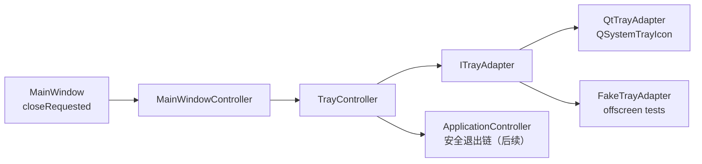
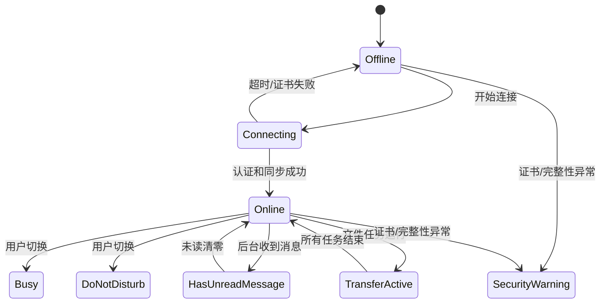
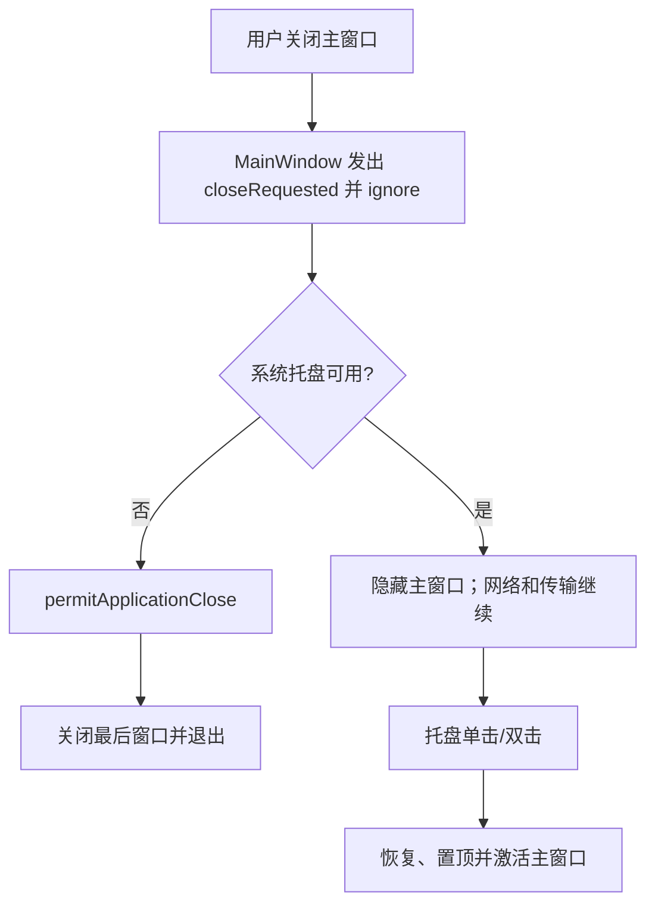

# 系统托盘与桌面驻留设计

## 组件边界

MainWindow 的 `closeEvent()` 仅在得到 `permitApplicationClose()` 后接受关闭；普通关闭发出 `closeRequested`。策略由 TrayController 决定，不让窗口类停止网络或数据库。

## 状态与优先级

`TrayState` 包含 Offline、Connecting、Online、Busy、DoNotDisturb、HasUnreadMessage、TransferActive 和 SecurityWarning。

若多个状态并存，显示优先级为 SecurityWarning > HasUnreadMessage > TransferActive > 用户状态 > Connecting > Offline。未读角标限制为 `1..99` 和 `99+`。

## 关闭到托盘

已实现上述路径和 FakeTrayAdapter 测试替身。窗口关闭策略“询问/直接退出”将在 SettingsService 接入后扩展。

## 真正退出顺序

目标顺序如下，任何阶段超时都应给用户明确选择，不能无限等待：

1. 设置 `shuttingDown`，停止接受新消息和新文件任务。
2. 停止断线重连、心跳和新的网络请求。
3. 将进行中的文件任务保存检查点；按策略等待/暂停/取消。
4. 尝试发送注销并以 2～3 秒超时关闭安全会话。
5. 停止网络 I/O 线程并 join。
6. 提交本地消息/草稿事务，关闭每线程 SQLite 连接。
7. 刷新并关闭日志。
8. 隐藏托盘、许可窗口关闭、退出 QApplication。

当前第一阶段没有网络、传输和 SQLite 资源，所以只实现步骤 8；不得把完整安全退出标为完成。

## 通知规则

- 当前聊天窗口激活且对应消息可见：不弹通知，正常推进已读水位。
- 应用在后台：弹出经隐私裁剪的通知并增加角标。
- 请勿打扰：普通消息只累计；安全警告和证书异常仍弹出。
- 锁屏/隐藏内容：只显示“收到一条新消息”，不显示人员和正文。
- 点击通知携带内部 ConversationId，不信任通知文本重新定位对象。
- 文件完成通知仅在 SM3 校验成功后发出；失败通知必须明确不可打开。

## 平台注意事项

| 平台 | 注意事项 | 状态 |
|---|---|---|
| Windows 10/11 | Explorer 重启后托盘图标重建；通知权限；高 DPI 角标 | 未实测 |
| 银河麒麟 | X11/Wayland、桌面壳托盘协议差异、通知服务存在性 | 需 POC |
| 统信 UOS | DDE 托盘菜单/单击行为、任务栏图标隐藏策略 | 需 POC |
| openEuler 桌面 | GNOME 可能依赖 AppIndicator 扩展；无托盘时必须降级 | 需 POC |

兼容测试必须分别截图目标窗口，不能用整块桌面截图替代；当前没有执行任何国产桌面实机验证。

## 已实现与待补

- 代码已实现：QSystemTrayIcon、菜单、状态色、动态未读角标、通知、打开/隐藏、关闭到托盘、无托盘降级、真正退出入口、Fake 适配器。
- 已验证：Qt 6.8.3/MSVC 编译、FakeTrayAdapter 关闭到托盘和角标、offscreen Qt 测试。
- 当前环境未验证：真实 Windows 托盘菜单/通知的人工交互；QtTrayAdapter 已编译。
- 已接入：入站消息成功落 SQLite 后从会话仓储重新聚合托盘未读角标；窗口不活跃时发送不含正文的隐私通知。打开主窗口不会误清全部未读，只有打开对应会话并满足可见条件时才清零该会话并推进已读水位。
- 尚未实现：在线状态子菜单、锁定、设置入口、通知点击精确路由、未完成文件任务退出询问和桌面重启恢复。
