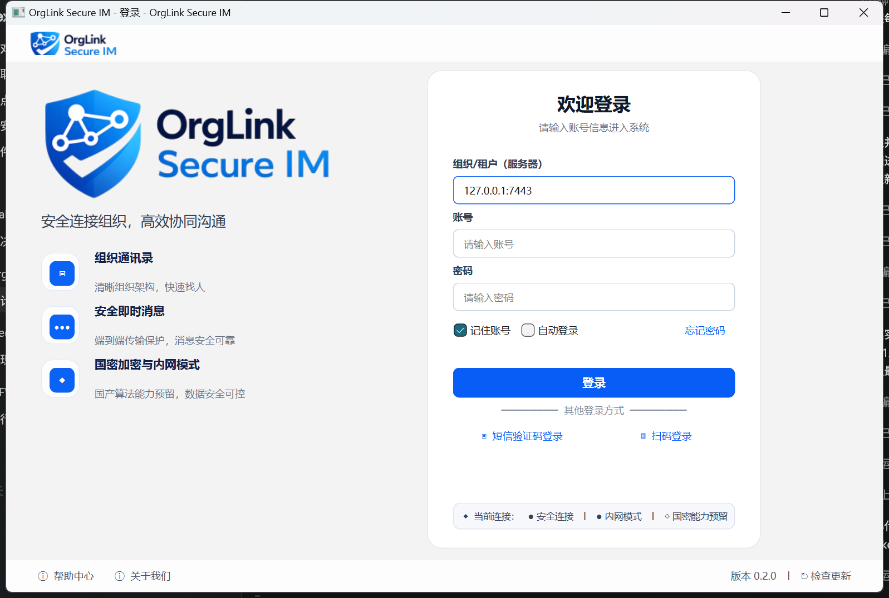
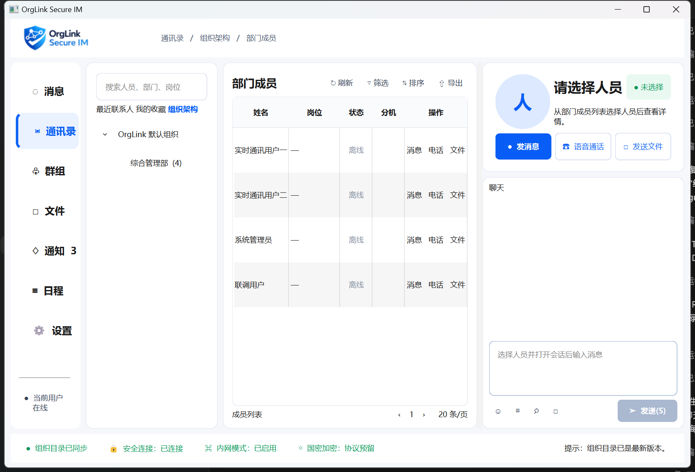
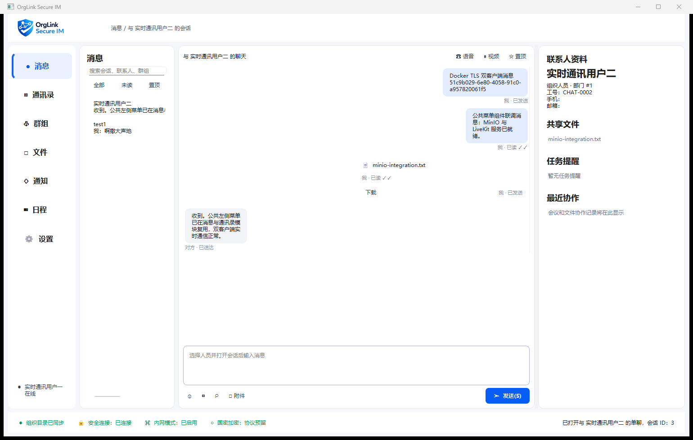
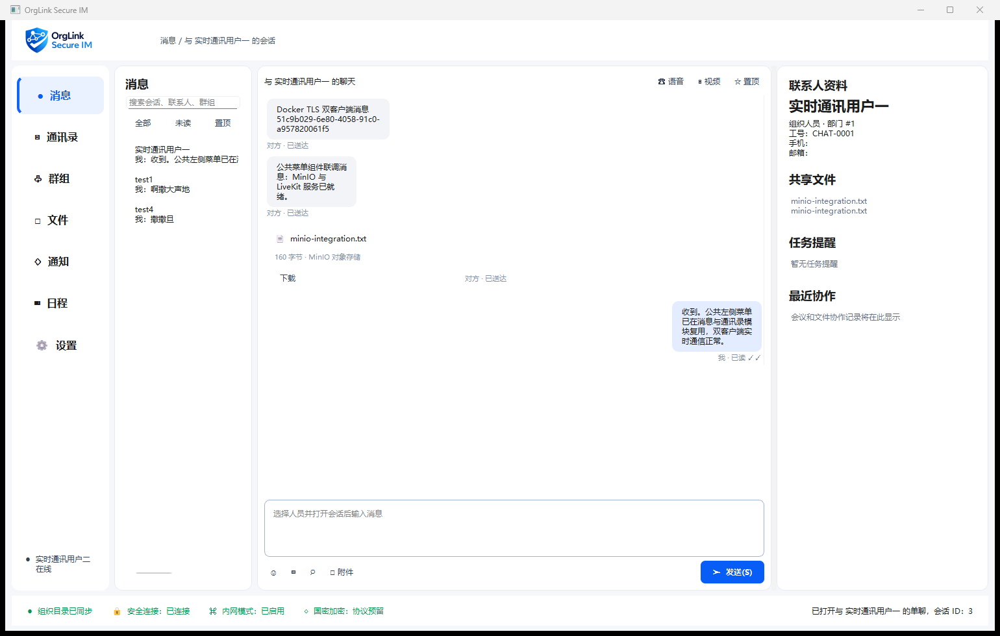

# 客户端界面线框与交互规格

## 2026-08 Qt Quick 响应式实现基线

- 生产入口已经迁移为 `Main.qml` + `ApplicationShell.qml`，消息、通讯录、群组、文件、通知、日程和设置均为 QML 页面；复杂业务通过 `QmlClientBackend`、`FileTransferController` 和 `NetworkClient` 的属性、信号/槽及意图接口暴露。
- 桌面宽度 `>=1120` 使用设计图的多栏结构；平板宽度 `720～1119` 保留主列表和必要工作区并隐藏次要详情；手机宽度 `<720` 使用公共抽屉导航，列表与详情互斥切换。所有主要触控入口不小于 44 逻辑像素，支持横竖屏重新排版。
- 文件中心桌面为“分类/存储 + 文件表 + 详情”三栏；平板折叠详情，手机改为文件卡片和独立详情。桌面双击与移动端显式“打开”按钮进入同一 C++ 安全打开用例。
- 文件正文不进入 QML：C++ 使用 `QSaveFile` 原子保存到当前用户下载目录，按内容 MIME/声明 MIME/扩展名确定图片、音频、视频或外部文档策略；可执行文件和脚本禁止启动。共享文件按 `asset_uuid` 去重，避免历史响应与实时推送重复显示。
- `qt-client-smoke` 会在 390×844、900×1180 和 1360×820 三组尺寸下逐个实例化七个业务页。Android/iOS 清单已就绪，但真机触摸、软键盘、后台恢复、摄像头、麦克风和签名包仍需对应设备 POC。

下文保留了迁移前 Widgets 线框、协议与服务端验收证据，作为功能对照，不再代表生产 View 技术栈。

## 实际渲染基线

登录窗口：



组织主窗口（生产 TLS 登录后的真实客户端）：



消息中心双客户端（生产 TLS、PostgreSQL、MinIO 与 LiveKit 动态链路）：





两张图片均于 2026-08-04 使用 Qt 6.8.3 构建，按各自实际窗口边界截取。登录页和主窗口已采用用户提供的 OrgLink Secure IM Logo；生产客户端已通过 TLS Gateway 与 PostgreSQL 动态链路验证。

## 统一视觉和可访问性

- 主窗口最大初始逻辑尺寸 `1100 × 750`、最小 `980 × 650`；登录窗口最大初始逻辑尺寸 `1050 × 700`，均会按当前可用屏幕自适应。
- 适配 100%、125%、150%、175%、200% DPI；布局使用 Qt Layout，不按像素硬编码文本宽度。
- 白色背景、政企蓝主色、浅灰分隔、低饱和状态色、扁平布局和轻量阴影。
- 禁止大面积强渐变、玻璃拟态、过度动画、难辨识纯图标按钮和依赖独立显卡的效果。
- 字体回退建议：系统 UI 字体 → Noto Sans CJK SC/思源黑体 → sans-serif。麒麟/UOS 必须实测中文省略、输入法候选窗和高 DPI。
- 键盘：Tab 顺序符合视觉顺序；Enter 提交登录/搜索；Ctrl+Enter 发送消息；Esc 关闭非关键弹窗；所有纯图标操作提供 accessibleName 与 tooltip。

### 公共应用外壳 ApplicationShell

- `ApplicationShell` 是主窗口各业务模块的公共 View 组件，唯一持有品牌顶栏、面包屑、左侧主菜单、当前登录用户卡片、消息未读角标和底部连接/安全状态栏。
- 消息、通讯录、群组、文件、通知、日程和设置页面只替换 `contentLayout()` 中的业务内容，不复制左侧菜单，也不各自维护当前用户状态。
- `sectionChanged(row)` 是模块切换的统一出口；Windows UI Automation 只改变选择集时，组件会同步当前行，保证鼠标、键盘、屏幕阅读器与自动化测试走同一切换路径。
- 当前登录用户由认证结果中的 PersonId、显示名和在线状态驱动，不允许写死为联系人或示例账号。

## 登录窗口 LoginWindow

```text
┌────────────────────────────────────────────────────────────┐
│                       OrgLink Secure IM                    │
│                            安信通                           │
│                                                            │
│              ┌──────────────────────────────┐              │
│              │ 服务器地址                    │              │
│              │ [ 192.168.1.10:7443       ] │              │
│              │                [检测连接]     │              │
│              │ 用户账号                      │              │
│              │ [                          ] │              │
│              │ 登录密码                      │              │
│              │ [ •••••••••••••••••••••• ] │              │
│              │ □ 记住账号    □ 自动登录      │              │
│              │         [      登录      ]    │              │
│              │ 安全连接：国密/TLS            │              │
│              │ 服务器证书：验证通过           │              │
│              └──────────────────────────────┘              │
│  版本 1.0.0     网络设置     证书信息     帮助              │
└────────────────────────────────────────────────────────────┘
```

| 项目 | 规格 |
|---|---|
| Qt 类 | `LoginWindow : QWidget` |
| Model | 登录表单状态（后续独立 `AuthenticationModel`） |
| Controller | `AuthenticationController` |
| 关键 signal | `loginRequested(server, login, password)` |
| 关键 slot | `setAuthenticating`、`showAuthenticationError` |
| 已实现 | 地址/账号/密码、禁止密码上下文菜单、Enter 登录、重复提交保护、友好错误 |
| 空状态 | 地址默认本机开发端口，账号和密码为空 |
| 加载状态 | 控件禁用，按钮显示“正在登录…” |
| 错误状态 | 清空密码，只显示脱敏提示 |
| 权限不足 | 认证失败，不创建主窗口会话 |

生产认证未接入时 Controller 明确拒绝；只有 `ORGLINK_ENABLE_MOCK_MODE` 构建允许非空表单进入开发界面，且没有固定模拟账号/密码。

## 组织架构主窗口 MainWindow

```text
┌──────────────────────────────────────────────────────────────────────────────────────────────┐
│ OrgLink 安信通   当前组织：某某单位                         在线   张三   设置   最小化   关闭 │
├──────┬──────────────────────────────┬────────────────────────────────────────────────────────┤
│      │ 搜索人员、部门、岗位          │ 部门：信息技术中心                    共 26 人          │
│ 组织 │ [__________________________] │ [全部] [在线] [在岗] [常用] [创建群聊] [刷新]           │
│ 消息 │ ▼ 某某单位                   │ ┌────────────────────────────────────────────────────┐ │
│  12  │   ▼ 办公室                   │ │ ● 张三   系统架构师    在线                         │ │
│ 群组 │      综合科                  │ │   分机 8012       [发消息] [传文件] [查看资料]      │ │
│ 文件 │   ▼ 信息技术中心             │ ├────────────────────────────────────────────────────┤ │
│ 通知 │      软件研发部              │ │ ● 李四   运维工程师    忙碌                         │ │
│ 设置 │      系统运维部              │ │   分机 8013       [发消息] [传文件] [查看资料]      │ │
│      │      信息安全部              │ └────────────────────────────────────────────────────┘ │
├──────┴──────────────────────────────┴────────────────────────────────────────────────────────┤
│ 安全连接：TLCP/SM2/SM3/SM4   组织版本：1256   网络延迟：18 ms   文件任务：2   未读：12      │
└──────────────────────────────────────────────────────────────────────────────────────────────┘
```

| 项目 | 规格 |
|---|---|
| Qt 类 | `ApplicationShell`、`MainWindow`、`OrganizationDirectoryView`、`DepartmentPersonnelView` |
| Model | `OrganizationTreeModel`、`DepartmentPersonnelModel` |
| Controller | `OrganizationController`、`PersonnelController`、`MainWindowController` |
| 关键 signal | `departmentActivated`、`directorySearchRequested`、`personActivated`、`sendMessageRequested`、`sendFileRequested`、`closeRequested` |
| 关键 slot | `selectDepartment`、`searchDirectory`、`showPerson`、`startDirectConversation` |
| 键盘 | Enter 搜索；上下键切换部门/人员；Enter 打开人员；双击人员发起单聊 |
| 空状态 | 未选择部门/部门无人时显示说明和刷新入口 |
| 加载状态 | 树或表局部骨架/进度，不清空旧快照 |
| 错误状态 | 顶部非阻塞错误条，旧缓存继续可用 |
| 权限不足 | 不显示敏感字段；操作时服务端仍重新鉴权 |

当前实现已按通讯录参考图升级为复用公共 `ApplicationShell` 的三栏工作区：左栏包含搜索、最近联系人和组织树；中栏包含部门面包屑、人数、工具栏、六列人员表及分页提示；右栏包含人员状态、消息/语音/视频/文件入口、脱敏基本信息、个人标签、私有备注和共同群组。当前用户以认证 PersonId 标记“（我）”，选择人员后由 `ContactController` 请求服务端权威详情；收藏、标签和备注仅在服务端确认后更新 `ContactCenterModel`，失败会重新拉取以回滚界面。

服务端 `6401`～`6406` 协议和 PostgreSQL `010_contact_center.sql` 已接通最近联系人、收藏、标签、备注、联系人详情与共同群组；最近联系只在成功建立唯一单聊时记录。真实窗口验收图：[test1 查看 test2](screenshots/contact-center-test1-20260805.png)、[test2 查看 test1](screenshots/contact-center-test2-20260805.png)。

## 人员详情抽屉 PersonnelDetailView

```text
┌────────────────────────────────┐
│ 人员资料                    ×  │
├────────────────────────────────┤
│             [头像]             │
│             张三               │
│          ● 当前在线            │
│ 所属单位：某某单位             │
│ 主部门：信息技术中心           │
│ 岗位：系统架构师               │
│ 工号：A00125                   │
│ 分机：8012                     │
│ 工作电话：0851-********        │
│ 工作邮箱：zhangsan@******      │
│ [     发消息     ]             │
│ [     发送文件   ]             │
│ [  加入常用联系人 ]            │
│ [  与他人创建群聊 ]            │
│ 其他任职                       │
│ · 项目管理办公室 / 技术顾问    │
└────────────────────────────────┘
```

建议宽度 300 px，可折叠。Model 为权限裁剪后的 PersonDetail，Controller 为 PersonnelController。加载时保留人员姓名并对字段显示骨架；字段无权查看显示“不可见”而不是伪装为空。当前第一阶段以内嵌详情区实现，独立抽屉待拆分。

## 聊天主界面 ChatView

```text
┌──────────────────────────────────────────────────────────────────────────────────────────────┐
│ OrgLink 安信通                                                                            │
├──────┬──────────────────────────────┬────────────────────────────────────────────────────────┤
│ 组织 │ 搜索会话                     │ 张三  ● 在线                         [资料] [更多]       │
│ 消息 │ [全部] [未读] [单聊] [群聊] │ 信息技术中心 / 系统架构师                               │
│  12  │ ● 张三                 3     ├────────────────────────────────────────────────────────┤
│ 群组 │   请把文档发给我       10:25 │         10:21                                          │
│ 文件 │ ● 项目研发群           8     │             ┌─────────────────────────────┐            │
│ 通知 │   李四：[文件]...       10:20 │             │ 你好，材料已整理完成。       │            │
│ 设置 │ ○ 王五                       │             └─────────────────────────────┘ 已读       │
│      │                              │ ┌─────────────────────────────┐                        │
│      │                              │ │ 好的，请发送给我。           │                        │
│      │                              │ └─────────────────────────────┘                        │
│      │                              ├────────────────────────────────────────────────────────┤
│      │                              │ [表情] [发送文件] [截图预留] [历史记录]                 │
│      │                              │ [ 输入消息……                                      ]   │
│      │                              │                               [发送 Ctrl+Enter]        │
└──────┴──────────────────────────────┴────────────────────────────────────────────────────────┘
```

| 项目 | 规格 |
|---|---|
| View | `ConversationListView`、`ChatView`、`MessageListView`、`MessageComposerView` |
| Model | `ConversationListModel`、`MessageListModel` |
| Controller | `ConversationController`、`ChatController` |
| signal | `conversationActivated`、`sendTextRequested`、`loadOlderRequested`、`retryRequested`、`receiptVisibleRangeChanged` |
| 分页 | 首屏 50 条；向上接近阈值按 `before_sequence` 加载 50 条；稳定锚点防跳动 |
| 草稿 | 按 ConversationId 本地保存；网络异常与会话切换不丢失 |
| 已读 | 窗口激活且消息进入可见区才提升连续已读水位 |
| 空/错/权限 | 新会话引导；局部重试；被移出群后只读并禁止继续发送 |

当前已实现 `ConversationListModel` 会话摘要、搜索、全部/未读/置顶过滤、服务端会话历史、发送文本、接收推送、MinIO 文件卡片、授权下载和 LiveKit 语音/视频入口，并显示 Sending/ServerAccepted/Delivered/Read 状态。当前活动会话在窗口可见时提升连续已读水位；草稿持久化、向上滚动自动翻页和精确到消息可见区的已读判定仍未实现。

## 群组中心 GroupCenterView

群组模块复用 `ApplicationShell`，不复制品牌栏、左侧主菜单、当前登录用户或底部连接状态。业务区采用“群组筛选上下文栏 + 统计/群表格 + 群详情”三段布局，已按参考图实现：

- 左栏：我的群组、创建/管理/加入/收藏筛选、分类、最近活跃和标签。
- 中栏：新建、按群号加入、筛选操作，全部/管理/活跃/未读统计卡，以及名称、类型、成员数、最近消息、活跃度和标签表格。
- 右栏：群号、群主、成员数、创建时间、标签、公告、共享文件和成员预览；群主/管理员才能使用成员管理。
- 群聊、文件下载和群视频会议复用现有消息、MinIO 与 LiveKit 链路，入口只传稳定 `conversation_id` 或 `asset_uuid`，服务端重新鉴权。

真实窗口验收图：[test1 群主视图](screenshots/group-center-test1-20260805.png)、[test2 成员视图](screenshots/group-center-test2-20260805.png)。

## 通知中心 NotificationCenterView

通知模块继续复用唯一 `ApplicationShell`，公共导航固定索引为 4，聊天未读与通知未读使用两个独立徽标。业务区按参考图实现为“通知分类上下文栏 + 通知分页表格 + 通知详情”三段布局：

- 左栏：标题/摘要/来源搜索，以及全部、审批、系统、安全、提及、文件、任务和其他分类的服务端权威计数。
- 中栏：全部已读、仅未读筛选和当前页 CSV 导出；表格展示标题/摘要、来源、时间、优先级和操作，默认每页 10 条。
- 右栏：标题、优先级、摘要、有序详情字段、业务编号、附件和处理说明；“去处理”“标记已读”“忽略”提交动作枚举，由服务端决定最终状态。
- 附件仅携带 `asset_uuid`，双击下载仍经 Gateway 按会话成员或通知接收人二次鉴权；内部 MinIO 对象键从不进入客户端。
- 服务端 008 迁移将通知主记录、详情字段、附件和状态事件分表保存；单条动作与批量已读均在事务中写审计。

真实窗口验收图：[test1 通知视图](screenshots/notification-center-test1-20260805.png)、[test2 通知视图](screenshots/notification-center-test2-20260805.png)。

## 创建群聊 GroupCreationDialog

```text
┌──────────────────────────────────────────────────────────────────────┐
│ 创建群聊                                                         × │
├───────────────────────────────┬──────────────────────────────────────┤
│ 搜索人员或部门                 │ 已选择 3 人                          │
│ [___________________________] │ 张三   信息技术中心            [移除] │
│ ▼ 某某单位                    │ 李四   信息安全部              [移除] │
│   ▼ 信息技术中心              │ 王五   软件研发部              [移除] │
│      ☑ 张三                   │ 群名称 [张三、李四、王五          ] │
│      ☑ 李四                   │ 群类型 ○ 普通群   ○ 临时群          │
│   ▼ 信息安全部                │              [取消] [创建群聊]       │
│      ☑ 王五                   │                                      │
└───────────────────────────────┴──────────────────────────────────────┘
```

当前 MVP 使用群名称、类型、公告、标签和人员 ID 批量输入对话框，由 `GroupController` 调用服务端事务接口；服务端对人员存在性、启用状态、成员身份和管理权限重新校验。后续再把人员 ID 输入升级为上述组织树选人器，保持协议和数据库主键不变。

## 文件传输中心 FileTransferCenterView

```text
┌────────────────────────────────────────────────────────────────────────────┐
│ 文件传输中心                                                           × │
├────────────────────────────────────────────────────────────────────────────┤
│ [正在传输 2] [等待中 1] [已完成] [失败]                    [打开下载目录] │
├────────────────────────────────────────────────────────────────────────────┤
│ ↑ 项目资料.zip    发送给：张三                                           │
│   1.20 GB / 2.00 GB  60%  18.5 MB/s  剩余约 44 秒                       │
│   ██████████████████████████░░░░░░░░░░░░        [暂停] [取消]           │
├────────────────────────────────────────────────────────────────────────────┤
│ ↓ 数据库备份说明.pdf  来自：李四                                         │
│   8.6 MB / 12.8 MB  67%  5.2 MB/s  剩余约 1 秒 [暂停] [取消]            │
├────────────────────────────────────────────────────────────────────────────┤
│ ✓ 系统设计说明书.docx  来自：王五  36.2 MB  SM3 校验通过                 │
│                                      [打开] [打开目录] [转发]             │
└────────────────────────────────────────────────────────────────────────────┘
```

Model 为 FileTransferListModel，Controller 为 FileTransferController，Service 使用有界后台线程池。状态包括等待、运行、暂停、校验、完成、失败、取消；速度采用 5～10 秒指数平滑，剩余时间在样本不足时显示“计算中”。当前已实现聊天内 8 MiB 有界上传、私有 MinIO 对象、文件消息和鉴权下载；独立传输中心、分片、暂停/续传、病毒扫描及大文件限速仍未实现。

## 设置中心 SettingsCenterView

设置模块复用唯一 `ApplicationShell`，公共导航固定索引为 6。参考图中的业务区域已经实现为“设置分类上下文栏 + 当前设置主栏 + 状态/预览右栏”响应式布局：

- 左栏：账号与资料、安全与登录、消息与通知、文件与存储、界面与主题、通话与设备、关于系统；各分类复用同一服务端设置快照和乐观 revision。
- 中栏：双重认证策略、设备/可信设备统计、启动与自动登录偏好、锁屏超时、聊天水印、防截屏提示、下载路径、语言与主题。控件变化提交完整快照，成功响应后才更新 Model。
- 右栏：TLS 连接、内网模式、国密能力、证书状态、传输加密、版本和个人对象存储用量；未部署的国密和端到端加密显示“协议预留”，不会伪造安全能力。
- PostgreSQL 009 建立每人员设置、storage quota 与 revision，017 扩展文件与存储偏好，018 扩展通话与设备偏好；更新和恢复默认均通过乐观并发控制，并在 `user_setting_events` 中保存前后快照。
- 下载路径仅是客户端偏好，服务端不访问该路径；诊断导出只包含版本和聚合状态，不包含账号、设备 UUID、证书正文、对象键或本地消息。
- “安全与登录”已拆分为独立 Qt Quick 响应式页面：桌面显示安全设置主栏与安全状态/系统信息右栏，平板和手机把右栏卡片并入主滚动区；四种尺寸使用同一 C++ 设置门面和服务端确认快照。
- “文件与存储”由 C++ 聚合服务端 `file_assets` 分类用量和本机缓存状态；缓存清理、目录打开及备份均执行真实文件系统操作，QML 只提交用户意图。桌面显示存储、缓存、同步和备份右栏，平板/手机按顺序并入主滚动区。
- “通话与设备”通过 Qt Multimedia 枚举本机麦克风、扬声器和摄像头，原始硬件标识只保存在本机设置中；音频打开测试和摄像头预览必须由用户主动触发，离页即停止采集。没有实时媒体会话时，网络指标和诊断历史明确显示“待检测”，不使用固定数字冒充检测结果。
- 主窗口固定使用 100% 不透明合成；历史 `windowTransparency` 字段仅为协议兼容保留，界面与主题页显示只读的“不透明”状态，不再提供半透明入口。
- 下载目录通过系统目录选择器取得本地 URL，再由 C++ 拒绝非本地或不存在目录；恢复默认设置需要二次确认并调用服务端 revision 事务。安全诊断只导出连接、加密、证书、设备数量和安全偏好，不包含口令、账号名、设备 UUID、证书正文或本地路径。
- 当前密码变更和设备明细协议尚未部署，界面入口会明确提示组织管理员流程或只展示设备汇总；双因素认证、启动/登录偏好、锁屏、水印、防截屏、下载路径、语言和主题均通过现有设置接口持久化，未用固定成功提示冒充功能。
- “关于系统”已实现独立 Qt Quick 页面：桌面为产品/授权主栏与版本、移动端下载、技术支持右栏，平板和手机把右栏卡片按同一顺序并入滚动区。客户端环境由 `QSysInfo` 读取，客户端版本由 CMake 工程版本注入，服务端发布版本来自认证后的设置摘要。
- 复制与导出系统信息只包含客户端/服务端版本、构建号、操作系统、组织名称和聚合安全状态；导出使用原子文件写入用户下载目录。升级检查仅比较服务端登记版本，不自动下载未签名安装包；授权、支持和移动端地址未配置时明确显示“未配置”，不会用参考图假数据冒充生产能力。

真实窗口验收图：[test1 设置视图](screenshots/settings-center-test1-20260805.png)、[test2 设置视图](screenshots/settings-center-test2-20260805.png)。

## 托盘菜单

```text
┌────────────────────────────┐
│ 打开安信通                 │
├────────────────────────────┤
│ 未读消息（12）             │
│ 文件传输（2）              │
├────────────────────────────┤
│ 在线状态  ▶                │
│ 锁定客户端                 │
│ 设置                       │
├────────────────────────────┤
│ 退出安信通                 │
└────────────────────────────┘
```

当前已实现打开、未读、文件传输和退出菜单，状态子菜单/锁定/设置入口待接入。托盘不可用时关闭窗口必须真正退出。

## 公共图标与默认头像规范

- Qt Quick 公共图标由 `IconCanvas.qml` 在 24×24 标准坐标中绘制，不再用 Unicode 字符模拟业务图形，因此不依赖目标机器的图标字体。消息、通讯录、群组、文件、通知、日程和设置七个核心图标已按设计稿重绘，其中设置使用真实齿轮轮廓而非同心圆占位。
- 尺寸与 1584×992 参考稿统一：主导航容器 26 px、标题栏工具图标 24 px、输入框图标 20 px、常规列表图标 20 px、功能入口 34 px；标准线宽为 2.1 px，图形仅保留约 1 px 安全边距，使实际可见轮廓达到约 22～24 px。高 DPI 下由 Canvas 按控件尺寸缩放。
- 普通色为 `#344054`，激活色为 `#075DF5`，禁用色为 `#AAB4C3`；按钮、标签和表格委托共享同一状态图标源。
- test1～test5 的默认头像为 256×256、圆形裁剪、明显 Q 版比例的虚构卡通人物，不使用真人照片；服务端只保存 Qt 资源标识，用户已有自定义头像时迁移不会覆盖。
- 人员表格、当前用户卡、联系人详情和群成员预览均复用头像解析函数；资源为空或损坏时回退姓名首字，避免空白或破图。
- 主页面浅色主题使用内置 `1584×992`、24 位 RGB 背景图：蓝白低对比网络连线和盾牌轮廓集中在画布边缘，中央保留业务卡片的纯净阅读区；图片没有 Alpha 通道，窗口仍固定 100% 不透明。深色主题继续使用完全不透明的深色背景，避免强制套用浅色素材降低可读性。
- 真实窗口验收图：[test2 浅色主页面背景与新版公共图标](screenshots/main-background-icons-test2-20260806.png)。截图按安信通窗口实际 `1584×992` 边界获取，未包含桌面或其他应用窗口。

## 公共字体与控件规范

- 客户端将 Sarasa UI SC 1.0.40 的 Regular、SemiBold、Bold 随 Qt 资源内置；登录、导航、表单、表格、标题以及聊天元数据统一使用该字体，不依赖操作系统字体安装状态。
- 聊天气泡正文与文件消息标题使用内置 Source Han Sans SC 2.005R Regular；发送者、时间、送达/已读状态不属于正文，继续使用 Sarasa UI SC。
- 统一字号层级为说明文字 12 px、正文和控件 14 px、区域标题 18 px、人员/群组重要标题 20 px、页面主标题和统计数字 24 px。
- 行式表格关闭单元格网格和表头竖分隔线，仅保留水平行边界；日程周视图属于二维时间网格，不套用行列表规则。
- 字体许可证随发布目录复制到 `licenses/fonts`；字体版本、上游发行地址和 SHA-256 记录在 `apps/client/assets/fonts/README.md`。
